# Quantum Bound States Simulation Design Specification

This document is the pre-implementation design specification for the Quantum Bound States HTML5 redesign. It replaces the legacy Java UI and re-organizes features into four screens.

- [Quantum Bound States Simulation Design Specification](#quantum-bound-states-simulation-design-specification)
  - [1. Simulation Design Overview](#1-simulation-design-overview)
  - [Learning Goals](#learning-goals)
  - [1. Scope: 1.0 Release](#1-scope-10-release)
  - [2. Screen overviews](#2-screen-overviews)
    - [Shared layout and behavior (all screens)](#shared-layout-and-behavior-all-screens)
      - [Global preferences (Preferences dialog)](#global-preferences-preferences-dialog)
      - [Value text highlights](#value-text-highlights)
    - [Home Screen](#home-screen)
      - [Screen Summary](#screen-summary)
      - [Screen Buttons](#screen-buttons)
    - [2.1 One Well](#21-one-well)
    - [2.2 Two Wells (Molecular Bonding)](#22-two-wells-molecular-bonding)
    - [2.3 Many Wells (Band Structure)](#23-many-wells-band-structure)
    - [2.4 Superposition](#24-superposition)
  - [3. Narrative flow and interactive component specifications (tab order)](#3-narrative-flow-and-interactive-component-specifications-tab-order)
    - [3.a Description narrative flow (overview -\> headings/paragraphs -\> tab order)](#3a-description-narrative-flow-overview---headingsparagraphs---tab-order)
    - [3.b PhET-iO design (see private spec)](#3b-phet-io-design-see-private-spec)
    - [3.c General Design Decisions](#3c-general-design-decisions)
    - [3.1 Energy Level Selector](#31-energy-level-selector)
    - [3.2 Mass Slider](#32-mass-slider)
    - [3.3 Value Labels Toggle](#33-value-labels-toggle)
    - [3.4 Number of Wells Slider](#34-number-of-wells-slider)
    - [3.5 Electric Field Slider](#35-electric-field-slider)
    - [3.6 Superposition Mode Toggle](#36-superposition-mode-toggle)
    - [3.7 Superposition Preset/Custom Dropdown](#37-superposition-presetcustom-dropdown)
    - [3.8 View Superposition Details Button](#38-view-superposition-details-button)
    - [3.9 Customize Button](#39-customize-button)
    - [3.10 Display Graph Radio Button Group](#310-display-graph-radio-button-group)
    - [3.11 Wave Function Display Options (Real, Imaginary, Magnitude, Phase) Checkboxes](#311-wave-function-display-options-real-imaginary-magnitude-phase-checkboxes)
    - [3.12 Potential Well Selector (Potential Preset on Superposition)](#312-potential-well-selector-potential-preset-on-superposition)
    - [3.13 Energy Graph (upper graph)](#313-energy-graph-upper-graph)
    - [3.14 Well Height Handle](#314-well-height-handle)
    - [3.15 Well Width Handles](#315-well-width-handles)
    - [3.16 Well Separation Handle](#316-well-separation-handle)
    - [3.17 Energy Offset Handle](#317-energy-offset-handle)
    - [3.18 Magnifier Tool (draggable probe)](#318-magnifier-tool-draggable-probe)
    - [3.19 Display Graph](#319-display-graph)
    - [3.20 Display Graph Visibility Toggle](#320-display-graph-visibility-toggle)
    - [3.21 Equation Button](#321-equation-button)
    - [3.22 Reference Line (draggable)](#322-reference-line-draggable)
    - [3.23 Magnifier Tool Toggle](#323-magnifier-tool-toggle)
    - [3.24 Reference Line Toggle](#324-reference-line-toggle)
    - [3.25 Timer Accordion Box](#325-timer-accordion-box)
    - [3.26 Time Controls (Restart, Play/Pause, Step)](#326-time-controls-restart-playpause-step)
    - [3.26a Speed Slider](#326a-speed-slider)
    - [3.27 Reset All Button](#327-reset-all-button)
    - [3.28 Equation Details Dialog](#328-equation-details-dialog)
    - [3.29 Superposition Details Preview Dialog](#329-superposition-details-preview-dialog)
    - [3.30 Superposition Customize Dialog](#330-superposition-customize-dialog)
    - [3.30a Coefficient Checkboxes (Simple/Complex)](#330a-coefficient-checkboxes-simplecomplex)
    - [3.30b Coefficient Magnitude Sliders (Simple/Complex)](#330b-coefficient-magnitude-sliders-simplecomplex)
    - [3.30c Phase Sliders (Complex)](#330c-phase-sliders-complex)
    - [3.30d Wave Function Preview (Simple/Complex)](#330d-wave-function-preview-simplecomplex)
    - [3.30e Coefficient and Phase Number Spinners (Advanced)](#330e-coefficient-and-phase-number-spinners-advanced)
    - [3.30f Clear Button](#330f-clear-button)
    - [3.30g Normalize and Save Button](#330g-normalize-and-save-button)
    - [3.31 Keyboard Help Dialog](#331-keyboard-help-dialog)

---

## 1. Simulation Design Overview

**Simulation:** Quantum Bound States HTML5

**Repository:** quantum-bound-states

**Screens:** One Well; Two Wells; Many Wells; Superposition

**Date:** January 2026

**Team:** (design) Brett Fiedler, Ariel Paul, Sam McKagan, Martin Veilette, Kathy Perkins; (development) Chris Malley, Martin Veilette

**Related links:**

- [Meeting Notes/Google Design Doc](https://docs.google.com/document/d/1cP0BbVlATr-j5TnQrZ-Nm_IPDfm0vr8EVoKfsnKfyKg/edit?usp=sharing)
- [PhET-iO Design Doc (restricted link)](<https://docs.google.com/document/d/1mqCHxN9JFDjXEBjg9oQc9y6GkWE6Dsq5oi00XJih03Q/edit?usp=sharing>
- [Legacy Simulation](https://phet.colorado.edu/en/simulation/quantum-bound-states)
-

---

## Learning Goals

- Visualize wave functions, probability densities, and energy levels for bound states in various potentials.
- Describe how multiple representations used for wave functions relate to one another.
- Compare and contrast single- and double-well energy levels and wave functions and explain a model for molecular bonding.
- Gain an intuition for what superposition is and the properties of a superposition state.
- Understand how the time-dependence varies with the energy of an eigenstate or the difference in energy for a superposition state
- Explain what is and is not time-dependent for an energy eigenstate ; and a superposition state.
- Predict how the curvature, amplitude, and decay of the wave function and the spacing of the energy levels depends on the shape of the potential and the mass of the particle.
- Gain an intuition for how band structure results in a lattice of many wells.
- Gain an intuition for how to go from the microscopic potential of a single atom to a macroscopic potential of a solid and its applications.

---

## 1. Scope: 1.0 Release

This is a standard sim release with all standard features. See the private PhET-iO appendix for client-facing design notes.

Description: Core

Sound: Basic

Voicing: None or Basic (what can be copied directly from Description)

Standalone Sims: The Two Well and Many Wells screens will again become standalone simulations, as with the legacy sim. TBD: Superposition screen?

---

## 2. Screen overviews

### Shared layout and behavior (all screens)

- **Play area:** Upper energy graph shows the potential energy curve and discrete energy levels. Drag handles adjust potential parameters. A magnifier tool and a vertical reference line can be shown. Right panel holds energy level selector, mass, and display controls, as well as screen-specific controls (number of wells, electric field, superposition mode/presets). A display graph below the play area shows a second plot (probability density or wave function).
- **Play area visual layering (back to front):** Background -> axes/grid -> potential curve -> energy lines or wave function (real, imaginary, magnitude, phase)/probability density -> value text highlights -> reference line -> drag handles -> magnifier lens <!-- TBD: VERIFY TAB ORDER WITH TEAM -->
- **Control area (left/bottom/right):**  Checkboxes to enable magnifier tool or the vertical reference line sit in bottom left. Timer accordion box and Time controls sit along the bottom. Reset All is anchored near the bottom right.

#### Global preferences (Preferences dialog)

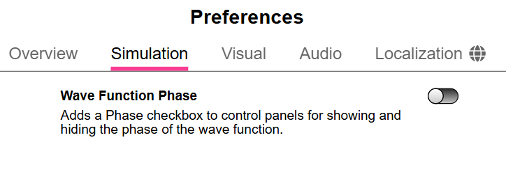

The simulation has one sim-specific control to add a Phase checkbox as a child to the Magnitude checkbox that affects the display for the Wave Function graph. During design discussions, it was decided that the Phase overlay only makes sense in the context of the Magnitude display option for the wave function and should depend on whether the Magnitude is enabled. In the legacy sim, this checkbox was always visible. In the new simulation, it is default NOT visible and must be added in the Preferences. This is available for the Display Graph in all 4 screens.

```yaml
accessibleName: Wave Function Phase
accessibleHelpText: "Adds a Phase checkbox to control panels for showing and hiding the phase of the wave function."
```

#### Value text highlights

(See [3.13 Energy Graph](#313-energy-graph-upper-graph) for mockups)

For drag handles and sliders that adjust numeric parameters (height, width, separation) and selected energy level, a value text highlight appears above the handle when hovered or focused. The default placement is above the handle (or to the left of the graph above the energy level for energy). The label can go outside of the graph bounds. When **Value Labels** is checked, value highlights remain visible at all times for any on screen drag handle.

---

### Home Screen

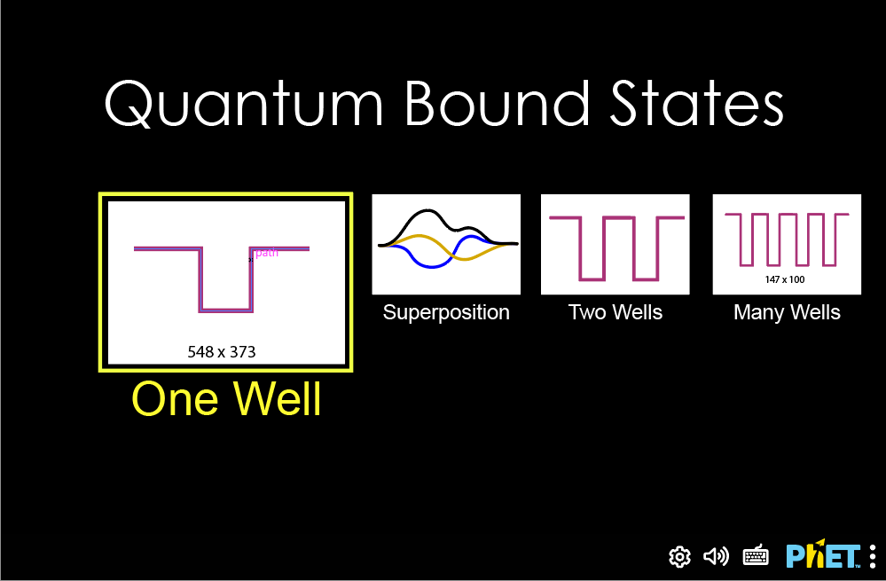

#### Screen Summary

Welcome to Quantum Bound States. It has 4 interactive screens that you can explore. Choose a screen to start exploring.

#### Screen Buttons

**One Well:**

```yaml
accessibleName: One Well

accessibleHelpText: Explore bound states in various single well potentials.
```

**Two Wells:**

```yaml
accessibleName: Two Wells

accessibleHelpText: Explore bound states and molecular bonding in two closely separated wells.
```

**Many Wells:**

```yaml
accessibleName: Many Wells

accessibleHelpText: Explore bound states and band structure in a periodic array of potential wells.
```

**Superposition:**

```yaml
accessibleName: Superposition

accessibleHelpText: Explore superposition states and their time-dependent behavior in various potentials.
```

---

### 2.1 One Well

**Mockup image:**

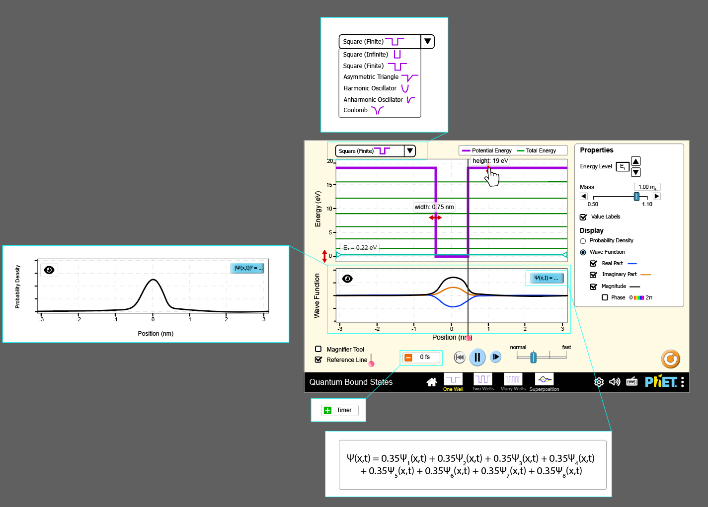

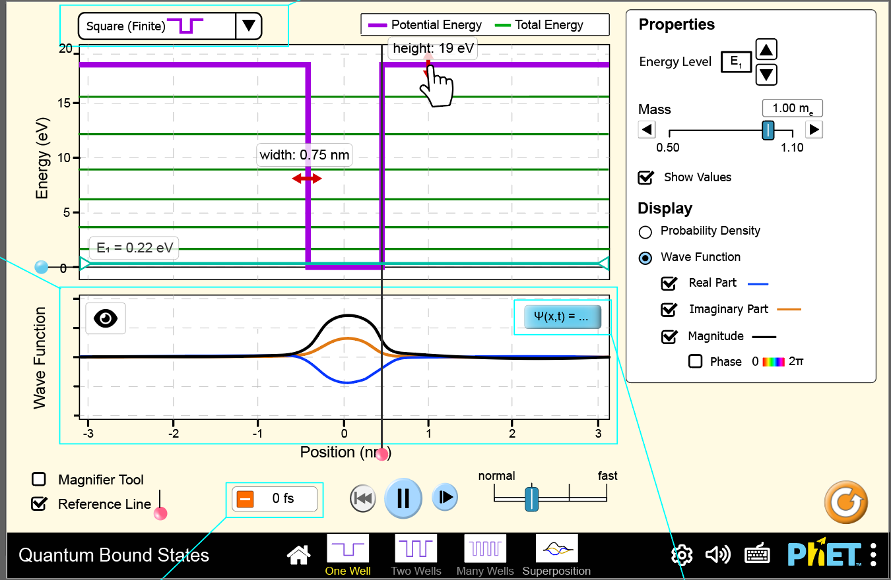

**Screen Summary:**

> The One Well Screen changes as you play with it. It has a Play Area and a Control Area.
>
> In Play Area:
>
> `TBD`
>
> In Control Area:
>
> `TBD`

<!-- **Play area:** Potential Type selector with Square (Infinite), Square (Finite), Asymmetric Triangle, Harmonic Oscillator, Anharmonic Oscillator, Coulomb. A single potential well is shown on the energy graph. When available for the potential well, drag handles adjust **height** (vertical) and **width** (horizontal). Offset handle adjusts energy Y-axis. Discrete energy level lines appear and are selectable with the pointer. A magnifier lens and a reference energy line can be shown. Display graph visibility toggle overlays top left of Display Graph. Equation button (label changes between psi(x,t) and |psi(x,t)|^2), overlaid on top-right of Display Graph. A **Energy Level selector** sits in the panel to the right in the play area and mirrors energy-line selection. The selected eigenfunction is shown below in the display graph; graph components display real, imaginary, magnitude, and phase parts.  Mass slider. Value Labels toggle. Display Graph Radio Button Group (Probability Density, Wave Function). Wave function part are enabled when Wave Function is selected, disabled when Probability Density is selected.

**Control area:** Magnifier and Reference Line toggles, plus the Timer accordion box and time controls.

**Current details:**

Currently:

- Potential: {potentialType}
- Well size: height {wellHeight} eV, width {wellWidth} nm
- Selected energy: level {levelIndex} at {energy} eV
- Display graph {displayVisibility}; {displayType} {partsShown}
- Time: {timeState}

**Interaction hint:**

Choose a potential and adjust height or width to see how energy levels and the wave function change. Select a level with the Energy level selector.

This screen has custom interactions. If needed, check out keyboard shortcuts under Sim Resources. -->

**Static descriptions and headings:**

- Properties
- Display
- Energy Graph
- Display Graph
- Tools
- Time Controls
- Sim Resources

**Value text highlights:** height (eV), width (nm), selected energy level index and energy (eV).

---

### 2.2 Two Wells (Molecular Bonding)

**Mockup image:**
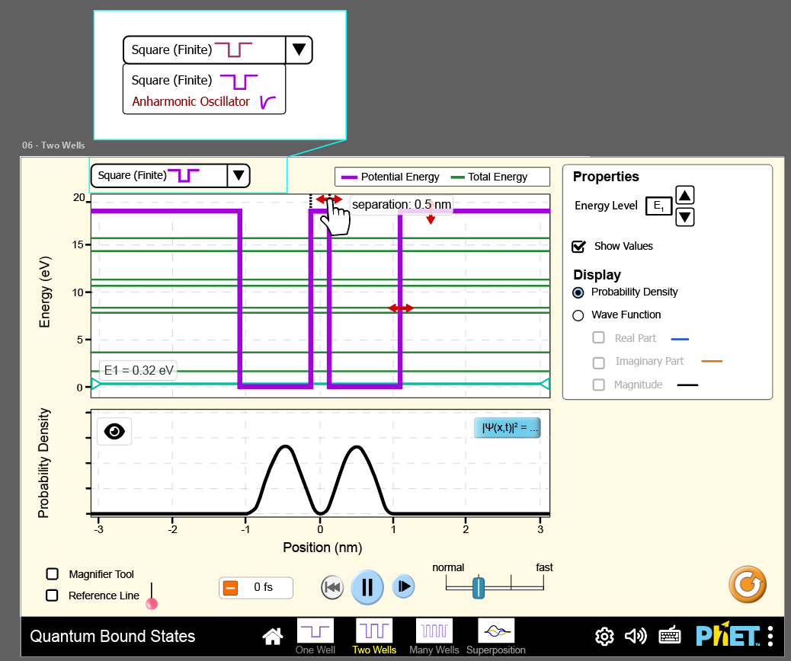

**Screen Summary:**

> The Two Wells Screen changes as you play with it. It has a Play Area and a Control Area.
>
> In Play Area:
>
> TBD
>
> In Control Area:
>
> TBD

<!-- **Play area:** Potential Type selector restricted to Square (Finite) and Anharmonic Oscillator. Two identical wells sit side by side. Drag handles adjust **height**, **width**, and **separation**. Discrete energy lines appear in symmetric/antisymmetric pairs and can be selected with the pointer. A **Energy level selector** sits in the panel to the right in the play area and mirrors energy-line selection. The selected state shows bonding or antibonding character. A magnifier lens and a reference energy line can be shown. Display graph visibility toggle overlays the top-left of the Display Graph. Equation button (label changes between psi(x,t) and |psi(x,t)|^2) overlays the top-right of the Display Graph. The selected eigenfunction is shown below in the display graph. Mass slider (optional). Value Labels toggle. Display Graph Radio Button Group (Probability Density, Wave Function).

**Control area:** Wave function parts are enabled when Wave Function is selected, disabled when Probability Density is selected. Magnifier and Reference Line toggles, plus the Timer accordion box.

**Current details:**

Currently:

- Potential: {potentialType}
- Well size: height {wellHeight} eV, width {wellWidth} nm, separation {separation} nm
- Selected state: level {levelIndex} at {energy} eV, {bondingState}
- Display graph {displayVisibility}; {displayType} {partsShown}
- Time: {timeState}

**Interaction hint:**

Move the separation handle to see bonding and antibonding pairs split. Adjust height and width to explore coupling, then choose a level with the Energy level selector. -->

**Static descriptions and headings:**

- Properties
- Display
- Energy Graph
- Display Graph
- Tools
- Time Controls
- Sim Resources

**Value text highlights:** height (eV), width (nm), separation (nm), selected energy level index and energy (eV).

---

### 2.3 Many Wells (Band Structure)

**Mockup image:**

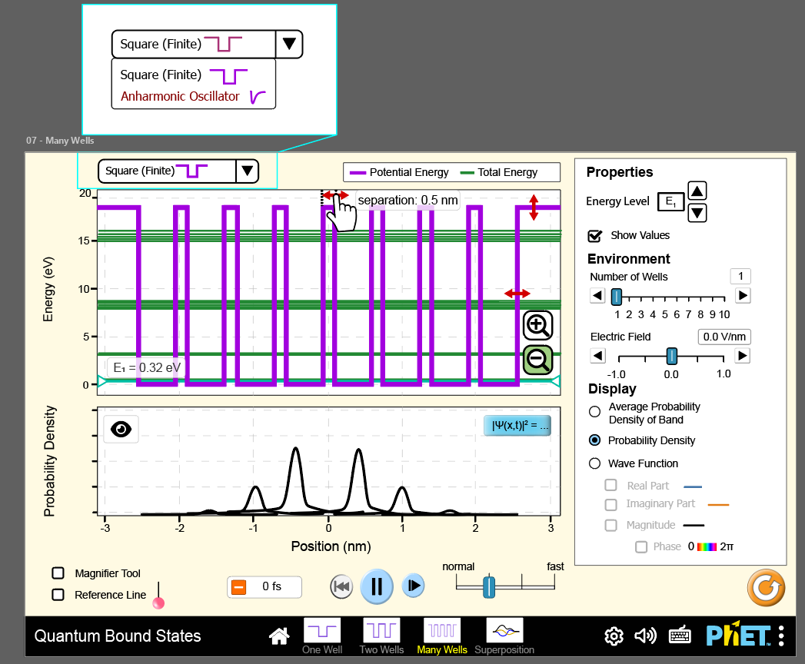

**Screen Summary:**

> The Many Wells Screen changes as you play with it. It has a Play Area and a Control Area.
>
> In Play Area:
>
> TBD
>
> In Control Area:
>
> TBD

<!-- **Play area:** Potential Type selector restricted to Square (Finite), Square (Infinite), Harmonic Oscillator, and Double Well. A periodic array of identical wells forms a lattice. Drag handles adjust **height**, **width**, **separation**, and **offset**. Offset handle adjusts energy Y-axis. A Number of Wells slider (1 to 10) controls how many wells appear. An Electric Field slider tilts the entire potential. For small numbers of wells, discrete energy lines appear and can be selected. A **Energy Level selector** sits in the panel to the right in the play area and mirrors energy-line selection; it becomes disabled when bands form. As the number increases, lines merge into energy bands and selection is disabled. A magnifier lens and a reference energy line can be shown. Display graph visibility toggle overlays the top-left of the Display Graph. Equation button (label changes between psi(x,t) and |psi(x,t)|^2) overlays the top-right of the Display Graph. The selected eigenfunction is shown below in the display graph. Mass slider. Value Labels toggle. Display Graph Radio Button Group (Average Probability Density of Band, Probability Density, Wave Function). Wave function parts are enabled when Wave Function is selected, disabled when Probability Density or Average Probability Density of Band is selected.

**Control area:**  Magnifier and Reference Line toggles, plus the Timer accordion box and time controls.

**Current details:**

Currently:

- Potential: {potentialType}
- Well size: height {wellHeight} eV, width {wellWidth} nm, separation {separation} nm, offset {offset} eV
- Wells: {wellCount}; spectrum {spectrumMode}
- Electric field: {field}
- Selected energy (when discrete): level {levelIndex} at {energy} eV
- Display graph {displayVisibility}; {displayType} {partsShown}
- Time: {timeState}

**Interaction hint:**

Change the the number of wells and explore the controls to change the potential shape, while observing changes in the Energy Graph. -->

**Static descriptions and headings:**

- Properties
- Environment
- Display
- Energy Graph
- Display Graph
- Tools
- Time Controls
- Sim Resources

**Value text highlights:** height (eV), width (nm), separation (nm), selected energy level index and energy (eV).

---

### 2.4 Superposition

**Mockup image:**

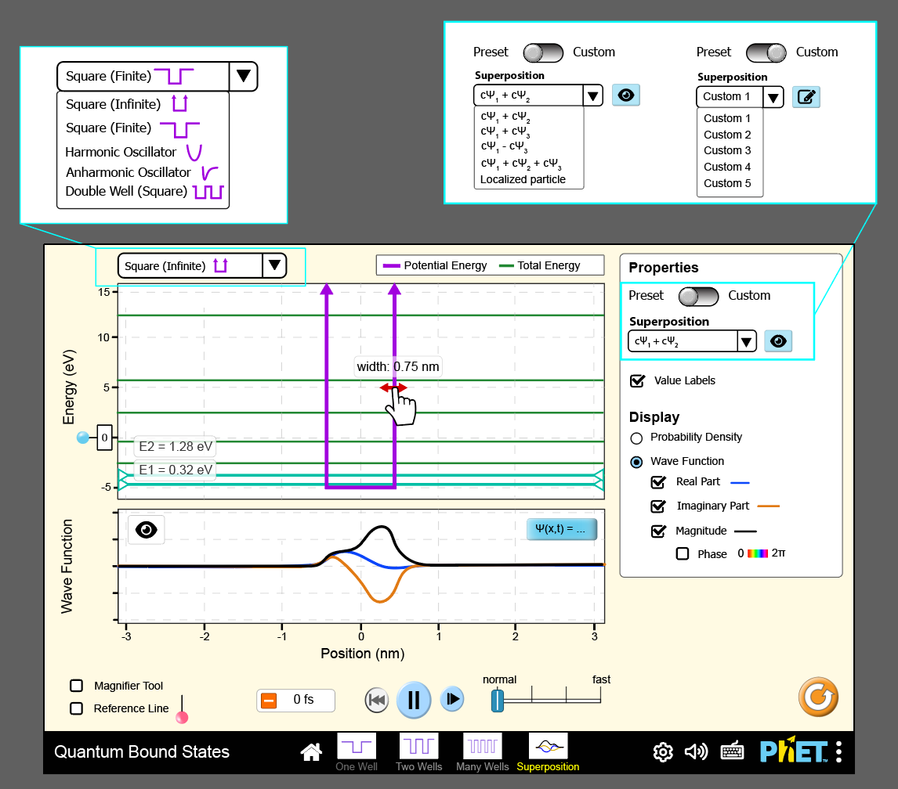

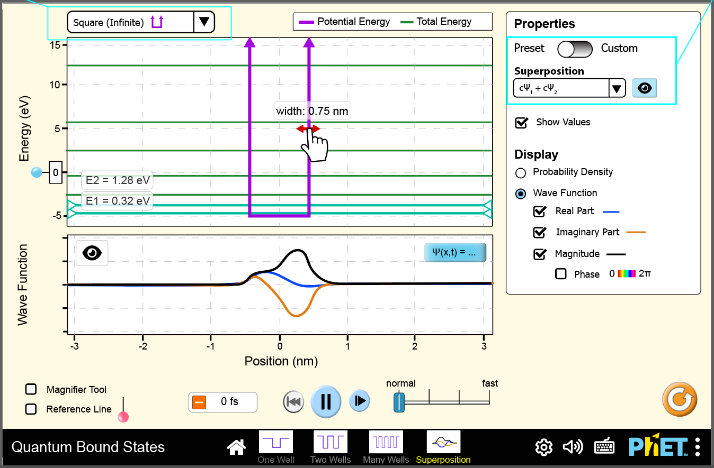

**Screen Summary:**

The Superposition Screen changes as you play with it. It has a Play Area and a Control Area.

In Play Area:

TBD

In Control Area:

TBD

<!-- No Energy level selector on this screen.

**Play area:** Potential preset selector with Square (Finite), Square (Infinite), Harmonic Oscillator, Double Well. Discrete energy levels are shown for reference. A time-dependent superposition of eigenstates is visualized. Well handles dependent on selected potential. Energy lines are not selectable on this screen. A magnifier lens and a reference energy line can be shown. Display graph visibility toggle overlays the top-left of the Display Graph. Equation button (label changes between psi(x,t) and |psi(x,t)|^2) overlays the top-right of the Display Graph. The selected superposition is shown below in the display graph. Superposition Mode toggle (Preset or Custom). Superposition State selector lists preset and custom states. View Details button opens a preview dialog. Customize button opens a dialog to edit coefficients. Value Labels toggle. Display Graph Radio Button Group (Probability Density, Wave Function). Mass slider (optional). Wave function parts are enabled when Wave Function is selected, disabled when Probability Density is selected.

**Control area:** Magnifier and Reference Line toggles, plus the Timer accordion box and time controls.

**Current details:**

Currently:

- Potential: {potentialType}
- Superposition: {mode}, {stateName}
- Mass: {mass}
- Display graph {displayVisibility}; {displayType} {partsShown}
- Time: {timeState}

**Interaction hint:**

Choose a preset or customize coefficients to explore time-dependent interference. Pause or step to inspect the pattern. -->

**Static descriptions and headings:**

- Properties
- Display
- Energy Graph
- Display Graph
- Tools
- Time Controls
- Sim Resources

**Value text highlights:** Width (nm), height (nm), separation (nm), selected superposition energy level indices and energy (eV).

---

## 3. Narrative flow and interactive component specifications (tab order)

> Authoring note: This section captures designer intent. Keyboard bindings and parameter values listed here reflect the current plan or best guess and can be adjusted to platform standards.

### 3.a Description narrative flow (overview -> headings/paragraphs -> tab order)

This section documents the intended narrative flow of descriptions for screen readers and keyboard users. It follows the PDOM/tab order defined in the view classes for the HTML5 redesign.

**Overview (Screen Summary):**

1. Play area overview text.
2. Control area overview text.
3. Current details list.
4. Interaction hint.

Tab order begins with the Potential Well/Preset selector, proceeds through the Energy Graph and its handles, then the Display Graph, and finally the remaining control-panel items.

**Tab order (PDOM order, feature-gated items noted):**

(H2) PLAY AREA

1. (H3) Properties
   1. Energy level selector [not on Superposition].
   2. Mass slider [One Well only].
   3. Superposition Mode toggle [Superposition only].
   4. Superposition State selector [Superposition only].
   5. Superposition Details button [Superposition only].
      1. {separate PDOM} (H2) Superposition Details (dialog):
          1. (ACCESSIBLE PARAGRAPH) {TBD} description/On-Screen Text
          2. Coefficients list
          3. Summed Equation preview
          4. Close Dialog (X)
   6. Customize Superposition button [Superposition only].
       1. {separate PDOM} (H2) Customize Superposition (dialog):
           1. (ACCESSIBLE PARAGRAPH) {TBD} description/On-Screen Text
           2. Coefficient checkboxes [Simple/Complex]
           3. Coefficient Value sliders [Simple/Complex]
           4. Phase sliders [Complex]
           5. Wave Function preview [Simple/Complex]
           6. Coefficient and Phase number controls [Advanced]
           7. Summed Equation preview [Simple/Complex]
           8. Normalize and Save button.
           9. Clear button
           10. Close Dialog (X)
   7. Value Labels toggle.
2. (HEADING) Environment (Many Wells only).
   1. Number of Wells slider (Many Wells only).
   2. Electric Field slider (Many Wells only).
3. (HEADING) Display
   1. Display Graph Radio Button Group.
      1. [Average Probability Density,] Probability Density, Wave Function.
   2. Wave Function Part toggles (enabled only when Wave Function is selected).
      1. Real
      2. Imaginary
      3. Magnitude
         1. Phase [if enabled in Preferences]
4. (HEADING) Energy Graph (3.13)
   1. (ACCESSIBLE PARAGRAPH) {TBD} Energy Graph description.
   2. Potential Well selector (or Potential Preset selector on Superposition).
   3. Well height handle [Square (Finite), Anharmonic Oscillator, Asymmetric Triangle].
   4. Well width handles [Square (Infinite), Square (Finite), Asymmetric Triangle, Harmonic Oscillator, Anharmonic Oscillator].
   5. Well separation handle [Two Wells, Many Wells, Superposition].
   6. Energy Offset handle [One Well, Superposition].
   7. Magnifier Tool [if added].
   8. Reference Position Line [if added].
5. (HEADING) Display Graph
   1. (ACCESSIBLE PARAGRAPH) {TBD} Display Graph description.
   2. Display Graph visibility toggle.
   3. Equation Details button.
      1. {separate PDOM} (H2) Equation Details (dialog):
          1. (ACCESSIBLE PARAGRAPH) {TBD} Equation description/On-Screen Text
          2. Close Dialog (X)

CONTROL AREA

1. (HEADING) Tools
   1. Magnifier Tool toggle.
   2. Reference Line toggle.
2. (Heading) Time Controls
   1. Timer accordion box.
   2. Time Controls (Restart Simulation > Play/Pause > Step > Speed Slider).
3. Reset All button.

SIM RESOURCES

1. Keyboard Help button.
   1. Preferences
      1. Simulation Tab
         1. Wave Function Phase toggle
   2. Keyboard Help dialog components (when open):
       1. Sim Actions
       2. Basic Actions
       3. Close Dialog (X)
  
<!-- **Per-screen narrative flow (designer intent):**

- One Well: Screen Summary -> Potential Well selector -> Energy Graph -> Height/Width handles -> Magnifier (if on) -> Display Graph -> Display Graph visibility -> Equation button -> Reference Line (if on) -> Energy level selector -> Mass -> Value Labels -> Display Graph Radio Button Group -> Wave Function Parts -> Magnifier toggle -> Reference Line toggle -> Timer accordion box -> Time Controls -> Reset All.
- Two Wells: Screen Summary -> Potential Well selector -> Energy Graph -> Height/Width/Separation handles -> Magnifier (if on) -> Display Graph -> Display Graph visibility -> Equation button -> Reference Line (if on) -> Energy level selector -> Mass (if present) -> Value Labels -> Display Graph Radio Button Group -> Wave Function Parts -> Magnifier toggle -> Reference Line toggle -> Timer accordion box -> Time Controls -> Reset All.
- Many Wells: Screen Summary -> Potential Well selector -> Energy Graph -> Height/Width/Separation/Offset handles -> Magnifier (if on) -> Display Graph -> Display Graph visibility -> Equation button -> Reference Line (if on) -> Energy level selector (disabled when bands form) -> Mass -> Value Labels -> Number of Wells -> Electric Field -> Display Graph Radio Button Group -> Wave Function Parts -> Magnifier toggle -> Reference Line toggle -> Timer accordion box -> Time Controls -> Reset All.
- Superposition: Screen Summary -> Potential Preset -> Energy Graph (reference only) -> Width handle -> Magnifier (if on) -> Display Graph -> Display Graph visibility -> Equation button -> Reference Line (if on) -> Value Labels -> Superposition Mode -> Superposition State -> View Details -> Customize -> Display Graph Radio Button Group -> Wave Function Parts -> Magnifier toggle -> Reference Line toggle -> Timer accordion box -> Time Controls -> Reset All. -->

**Narrative details to confirm (designer intent):**

- Whether the timer readout should announce continuously while playing or only on focus/pause.
- Whether magnifier and reference line positions should announce on every step or only on release.
- Whether the Display Graph accessibleParagraph should include the list of visible wave function parts in its description.
- How should the equation be read out?

### 3.b PhET-iO design (see private spec)

See [PhET-iO Design Doc (private)](https://docs.google.com/document/d/1mqCHxN9JFDjXEBjg9oQc9y6GkWE6Dsq5oi00XJih03Q/edit?tab=t.0#heading=h.c27zalylc2r9).

### 3.c General Design Decisions

- No equations will be rendered in Math font for this simulation. This includes the equations in the superposition dialog.

### 3.1 Energy Level Selector

**Component Type:**

NumberControl (phet/sun)

**Mockup image:**


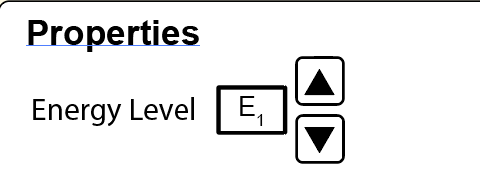

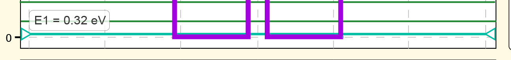

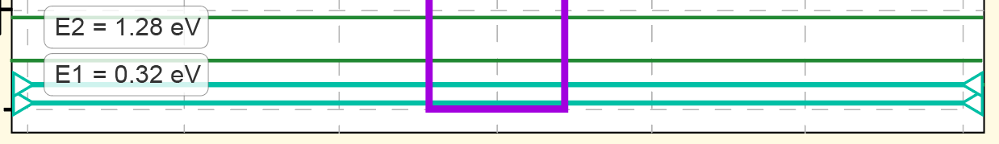

**Screens:**

One Well, Two Wells, Many Wells; not on Superposition

**Component Description:**

Select which discrete energy level eigenstate is displayed.

**Pedagogical significance:**

Supports deliberate selection of eigenstates to compare ordering, spacing, and spatial structure.

**Initial State:**

TBD

**Design questions (default behavior):**

- What is the default energy level selection per screen, and should it reset when the potential changes?
- When energy bands form, should the selector be disabled but keep the last selection visible, or clear it?
- Should the selector always mirror pointer selection from the energy graph, or can it diverge?

**Adjustable values:**

Integer index from 1 to the number of available bound states. Read-only energy value display in eV for the selected level. Default = 1.

Selected energy index and the corresponding energy value (derived).

**Pointer behavior:**

Click stepper arrows or drag the selector control to change the index. Clicking an energy line in the graph updates the selector (pointer only).

**Keyboard behavior:**

Arrow Left/Right decreases/increases by 1; Home/End jumps to first/last available level.

**Tab order notes:**

In the tab order on One/Two/Many Wells when discrete levels are available; removed on Superposition

Enabled/disabled; focused; pressed

**Motion/animation:**

None.

**Accessibility strings (Core Description):**

```yaml
accessibleName: "Energy Level".

accessibleHelpText: "Choose a energy level level; the selected line is highlighted."

accessibleObjectResponse: "energy level level {index} of {count}, {value} electronvolts"
```

**Visual ordering/overlap:**

N/A (play area element).

**Edge cases:**

When a potential change reduces the number of bound states, the selected index jumps to the ground state (E1).

**Sound design:**

Default UI sound.

### 3.2 Mass Slider

**Component Type:**

NumberControl (phet/sun)

**Mockup image:**

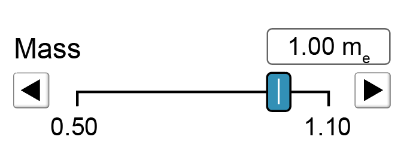

**Screens:**

One Well only

**Component Description:**

Adjust the particle mass relative to an electron mass.

**Pedagogical significance:**

Demonstrates mass dependence of quantization and wavelength, reinforcing physical intuition.

**Initial State:**

TBD

**Design questions (default behavior):**

- What is the default mass value, and should mass changes be allowed while the sim is playing?
- Should mass be per-screen or global across screens?
- Do we need snapping to common masses (electron, proton) or free continuous values only?

**Adjustable values:**

Legacy range 0.50 to 1.10 times electron mass (m_e), default 1.00. Step 0.01.

Major ticks at 0.50, 0.70, 0.90, 1.10 m_e

Mass value.

**Pointer behavior:**

Drag the slider thumb or click the track to move.

**Keyboard behavior:**

Arrow Left/Right adjusts by large steps; Shift + Arrow for smaller steps.

**Tab order notes:**

In the tab order before Value Labels on screens where Mass is adjustable; removed when mass is fixed or omitted.

Focused, hover, dragged; disabled when hidden.

**Motion/animation:**

Slider thumb moves with pointer/keyboard.

**Accessibility strings (Core Description):**

```yaml
accessibleName: "Mass".

accessibleHelpText: "Adjust the relative mass of the system."

accessibleObjectResponse: "{value} times electron mass"
```

RELATED ISSUE: <https://github.com/phetsims/quantum-bound-states/issues/11>

**Visual ordering/overlap:**

N/A.

**Edge cases:**

Changing mass may shift the number of bound states; selected energy index goes to E1 if needed.

**Sound design:**

Default slider sound.

### 3.3 Value Labels Toggle

**Component Type:**

Checkbox (phet/sun)

**Mockup image:**

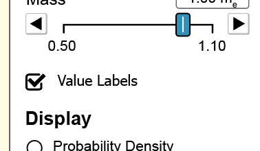

**Screens:**

All

**Component Description:**

Keep numeric value labels visible for handles and sliders.

**Pedagogical significance:**

Scaffolds quantitative interpretation of parameters and energies when needed.

TBD

**Initial State:**

TBD

**Design questions (default behavior):**

- Which values become visible when Value Labels is enabled (handles only, graph annotations, or both)?
- Should Value Labels default to off on all screens, or on for specific learning goals?
- When Value Labels is on, should labels remain visible during dragging or fade after release?

**Adjustable values:**

Boolean (on/off). Default: off.

Value Labels on/off.

**Pointer behavior:**

Click to toggle.

**Keyboard behavior:**

Space/Enter toggles when focused.

**Tab order notes:**

Always in the tab order (control panel).

Checked/unchecked; focused

**Motion/animation:**

Value labels appear/disappear immediately.

**Accessibility strings (Core Description):**

```yaml
accessibleName: "Value Labels".

accessibleHelpText: "Keep value labels visible for handles and sliders."

accessibleContextResponseChecked: "Value labels stay visible."

accessibleContextResponseUnchecked: "Value labels show on focus."
```

**Visual ordering/overlap:**

When on, value labels render above handles or to the top left of energy level lines (inside graph). Above all graph elements.

**Edge cases:**

Value labels should avoid overlapping the magnifier lens or reference line labels.

**Sound design:**

None.

### 3.4 Number of Wells Slider

**Component Type:**

NumberControl (phet/sun)

**Mockup image:**

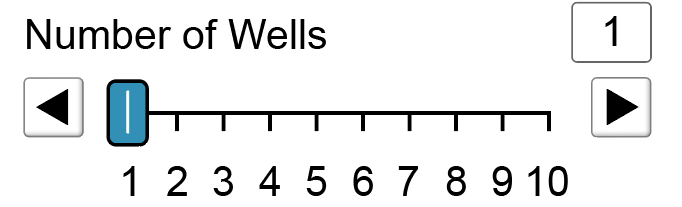

**Screens:**

Many Wells

**Component Description:**

Set how many wells appear in the periodic lattice.

**Pedagogical significance:**

Shows how increasing periodicity leads from discrete levels to energy bands.

**Initial State:**

TBD

**Design questions (default behavior):**

- What is the default number of wells, and should we cap the count based on performance or pedagogy?
- At what well count should we declare band formation, and how should that threshold be communicated?
- Should changing the well count reset the selected energy level and display graph mode?

**Adjustable values:**

Integer 1 to 10 (legacy). Default: 5.

Number of wells.

**Pointer behavior:**

Drag slider thumb; click track to jump.

**Keyboard behavior:**

Arrow Left/Right decreases/increases by 1; Home/End jumps to min/max.

**Tab order notes:**

In the tab order on Many Wells only.

Focused, hover, dragged.

**Motion/animation:**

Slider thumb moves with pointer/keyboard.

**Accessibility strings (Core Description):**

```yaml
accessibleName: "Number of Wells".

accessibleHelpText: "Set how many wells appear in the lattice."

accessibleObjectResponse: "number of wells {value}"

accessibleContextResponse: "More wells can form energy bands."
```

**Visual ordering/overlap:**

N/A.

**Edge cases:**

When the number of wells is large enough for bands to form, the Energy level selector is disabled.

**Sound design:**

None.

### 3.5 Electric Field Slider

**Component Type:**

NumberControl (phet/sun)

**Mockup image:**

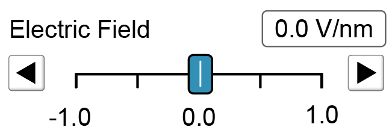

**Screens:**

Many Wells

**Component Description:**

Tilt the periodic potential to represent an applied electric field.

**Pedagogical significance:**

Illustrates how external fields tilt potentials and affect localization and band structure.

**Initial State:**

TBD

**Design questions (default behavior):**

- What is the default electric field value (zero), and should nonzero fields be allowed when the sim is paused only?
- Should the field slider snap to 0 for easy reset, or require explicit Reset All?
- How should extreme field values be limited to keep the potential readable and meaningful?

**Adjustable values:**

Legacy range -1 to 1 (field constant, unit-less), default 0. Step 0.1.

Electric field strength.

**Pointer behavior:**

Drag slider thumb; click track to jump.

**Keyboard behavior:**

Arrow Left/Right adjusts by small increments; Shift + Arrow for larger steps.

**Tab order notes:**

In the tab order on Many Wells only.

Focused, hover, dragged.

**Motion/animation:**

Slider thumb moves with pointer/keyboard; potential tilts in real time.

**Accessibility strings (Core Description):**

```yaml
accessibleName: "Electric Field".

accessibleHelpText: "Apply an electric field to tilt the potential."

accessibleObjectResponse: "electric field {value}"
```

**Visual ordering/overlap:**

N/A.

**Edge cases:**

At extreme values, ensure the potential remains in view and axes rescale as needed.

**Sound design:**

None.

### 3.6 Superposition Mode Toggle

**Component Type:**

ToggleButton (phet/sun)

**Mockup image:**


**Screens:**

Superposition

**Component Description:**

Switch between using a preset superposition and a custom superposition.

**Pedagogical significance:**

Emphasizes the conceptual difference between single eigenstates and superpositions with time dependence.

TBD

**Initial State:**

TBD

**Design questions (default behavior):**

- Which mode should be default (Preset or Custom), and should it persist across sessions?
- When switching modes, should the selected state persist if it exists in both modes?
- If no custom states exist yet, should Custom mode be disabled or show placeholders?

**Adjustable values:**

Preset / Custom. Default: Preset.

Selected mode.

**Pointer behavior:**

Click to select Preset or Custom.

**Keyboard behavior:**

Arrow keys within the toggle group; Space selects.

**Tab order notes:**

In the tab order on Superposition only.

Selected/unselected; focused; hover/pressed.

**Motion/animation:**

None.

**Accessibility strings (Core Description):**

```yaml
accessibleName: "Superposition Mode".

accessibleHelpText: "Choose Preset to use built-in states or Custom to edit your own."

accessibleObjectResponse: "preset mode" / "custom mode"
```

**Visual ordering/overlap:**

N/A.

**Edge cases:**

Custom mode always shows five fixed slots ("Custom 1" through "Custom 5"). Empty slots load a default blank state when selected. Slots cannot be renamed or deleted.

**Sound design:**

Default toggle click sound.

### 3.7 Superposition Preset/Custom Dropdown

**Component Type:**

ComboBox (phet/sun)

**Mockup image:**

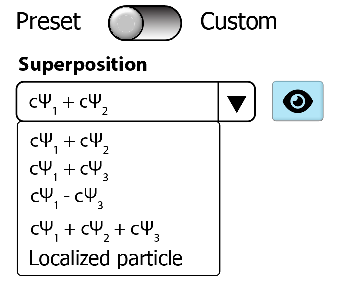
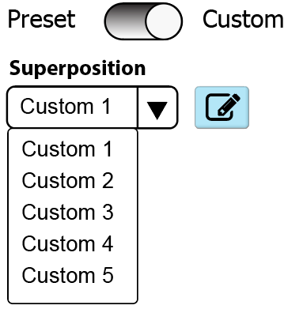

**Screens:**

Superposition

**Component Description:**

Select a preset or saved custom superposition state.

**Pedagogical significance:**

Provides curated states for comparing interference patterns and time evolution.

**Initial State:**

TBD

**Design questions (default behavior):**

- Which preset should be selected by default per potential, and should it reset on potential change?
- Should invalid custom presets be hidden or shown with a disabled state?
- Do we need any sorting or grouping (Presets vs Custom) beyond the current list order?

**Adjustable values:**

  **Preset list:** "c*Psi1 + c*Psi2", "c*Psi1 + c*Psi3", "c*Psi1 - c*Psi2", "c*Psi1 + c*Psi2 + c*Psi3", "Localized particle".

  TBD: Are there more or different presets needed per potential?

  **Custom list:** fixed slots "Custom 1" through "Custom 5". Default: first item in the active list.

  TBD: Are custom slots attached to potential type

Selected state name and its coefficients.

**Pointer behavior:**

Click to open list and select an item.

**Keyboard behavior:**

Arrow keys to move; Enter/Space selects; first-letter navigation jumps to matching items.

**Tab order notes:**

In the tab order on Superposition only.

Enabled/disabled; focused; hover/pressed; selected.

**Motion/animation:**

Standard dropdown open/close.

**Accessibility strings (Core Description):**

```yaml
accessibleName: "Superposition State".

accessibleHelpText: "Choose a superposition state from the list."

accessibleObjectResponse: "superposition state {state name}"

accessibleContextResponse: "Coefficients update for the selected state."
```

**Visual ordering/overlap:**

N/A.

**Edge cases:**

Custom slots are fixed "Custom 1" through "Custom 5" and cannot be renamed or deleted. Selecting an empty slot loads a default blank state for editing.

**Sound design:**

Default menu selection sound.

### 3.8 View Superposition Details Button

**Component Type:**

TextPushButton (phet/sun)

**Mockup image:**


**Screens:**

Superposition

**Component Description:**

Open a read-only dialog showing coefficient magnitudes and phases for the current superposition (phases shown in units of π).

**Pedagogical significance:**

Helps learners connect coefficient and phase choices to the resulting state description.

**Initial State:**

TBD

**Design questions (default behavior):**

- Should the View Details button be enabled only when a valid preset/custom selection exists?
- Should the dialog update live if the selection changes while it is open?
- Should the dialog remember its last position/size if it is reopened?

**Adjustable values:**

N/A (button).

Dialog open/close state (transient).

**Pointer behavior:**

Click to open the dialog.

**Keyboard behavior:**

Space/Enter opens when focused; Escape closes the dialog.

**Tab order notes:**

In the tab order on Superposition only.

Focused; hover/pressed; disabled when no state is selected (should not occur).

**Motion/animation:**

Dialog appears/disappears; no custom animation specified.

**Accessibility strings (Core Description):**

```yaml
accessibleName: "View Details".

accessibleHelpText: "Open a dialog listing coefficients for the current superposition. Phase values use pi units."

accessibleContextResponse: "Details dialog opened."
```

**Visual ordering/overlap:**

Dialog appears above all content (modal).

**Edge cases:**

Opening the dialog traps focus; closing returns focus to the View Details button.

**Sound design:**

None.

### 3.9 Customize Button

**Component Type:**

TextPushButton (phet/sun)

**Mockup image:**


**Screens:**

Superposition

**Component Description:**

Open a dialog for editing superposition coefficients.

**Pedagogical significance:**

Enables experimentation with coefficients and phases to see how superpositions control dynamics.

**Initial State:**

TBD

**Design questions (default behavior):**

- Which customize mode (Simple/Complex/Advanced) should open by default, and should we remember the last used mode?
- Should changes apply immediately or only after an explicit Apply/Close action?
- Do we need a way to revert to the last saved custom state within the dialog?

**Adjustable values:**

N/A (button).

Dialog open/close state (transient).

**Pointer behavior:**

Click to open the dialog.

**Keyboard behavior:**

Space/Enter opens; Escape closes the dialog.

**Tab order notes:**

In the tab order on Superposition only.

Focused; hover/pressed; disabled when Superposition Mode is Preset.

**Motion/animation:**

Dialog appears/disappears; no custom animation specified.

**Accessibility strings (Core Description):**

```yaml
accessibleName: "Customize".

accessibleHelpText: "Open a dialog to edit coefficients for a custom superposition."

accessibleContextResponse: "Customize dialog opened."
```

**Visual ordering/overlap:**

Dialog appears above all content (modal).

**Edge cases:**

Customize edits the currently selected Custom slot; if none is selected, it opens on Custom 1.

**Sound design:**

None.

### 3.10 Display Graph Radio Button Group

**Component Type:**

RadioButtonGroup (phet/sun)

**Mockup image:**

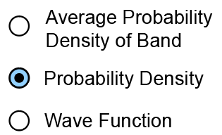

**Screens:**

All (options vary by screen)

**Component Description:**

Choose what the display graph shows.

**Pedagogical significance:**

Encourages comparison of probability density and wave function representations and their roles.

**Initial State:**

TBD

**Design questions (default behavior):**

- What is the default display graph selection on each screen?
- When switching away from Wave Function, should Wave Function part toggles reset or persist?
- Should the selection persist across screen changes or reset per screen?

**Adjustable values:**

Options by screen: One Well = Probability Density, Wave Function. Two Wells = Probability Density, Wave Function. Many Wells = Average Probability Density of Band, Probability Density (when discrete), Wave Function. Superposition = Probability Density, Wave Function.

Selected display type.

**Pointer behavior:**

Click a radio option to select.

**Keyboard behavior:**

Arrow keys within the group; Space selects.

**Tab order notes:**

In the tab order when Display Graph controls are shown (all screens).

Selected/unselected; focused; hover/pressed; disabled options when not applicable.

**Motion/animation:**

Switching updates the display graph immediately.

**Accessibility strings (Core Description):**

```yaml
accessibleName: "Display Graph".

accessibleHelpText: "Choose what the display graph shows."

accessibleName (options): "Probability Density", "Wave Function", "Average Probability Density of Band" (Many Wells only).

accessibleObjectResponse: "display graph set to {selection}"
```

**Visual ordering/overlap:**

N/A.

**Edge cases:**

When Wave Function is selected, wave function part toggles appear; when not selected, they are hidden and removed from tab order.

**Sound design:**

None.

### 3.11 Wave Function Display Options (Real, Imaginary, Magnitude, Phase) Checkboxes

**Component Type:**

CheckboxGroup (phet/sun)

**Mockup image:**

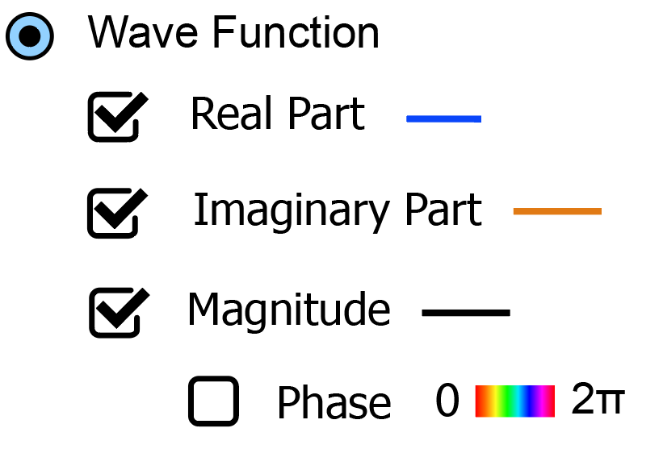

**Screens:**

All (visible only when Display Graph is set to Wave Function)

**Component Description:**

Show or hide the real, imaginary, magnitude, and phase parts of the wave function.

**Pedagogical significance:**

Builds understanding of complex wave functions by separating real, imaginary, magnitude, and phase views.

**Initial State:**

TBD

**Design questions (default behavior):**

- Which wave function parts are on by default (Real/Imaginary/Magnitude/Phase)?
- Should Phase appear only when Magnitude is enabled, or also be available independently in Preferences?
- When switching to Probability Density, should these toggles remember their last Wave Function state?

**Adjustable values:**

Boolean toggles for Real, Imaginary, Magnitude, Phase. Default: Magnitude on, others off. Phase toggle is not present on Two Wells.

On/off state for each part.

**Pointer behavior:**

Click each checkbox to toggle.

**Keyboard behavior:**

Space/Enter toggles when focused.

**Tab order notes:**

In the tab order only when Display Graph is set to Wave Function; removed otherwise.

Checked/unchecked; focused; hover/pressed.

**Motion/animation:**

Wave function overlays update immediately.

**Accessibility strings (Core Description):**

```yaml
accessibleName: "Wave Function Parts".

accessibleName (Real): "Real Part".

accessibleName (Imaginary): "Imaginary Part".

accessibleName (Magnitude): "Magnitude".

accessibleName (Phase): "Phase".

accessibleHelpText (Real): "Show or hide the real part."

accessibleHelpText (Imaginary): "Show or hide the imaginary part."

accessibleHelpText (Magnitude): "Show or hide the magnitude."

accessibleHelpText (Phase): "Show or hide the phase."

accessibleContextResponseChecked (Real): "Real part shown."

accessibleContextResponseUnchecked (Real): "Real part hidden."

accessibleContextResponseChecked (Imaginary): "Imaginary part shown."

accessibleContextResponseUnchecked (Imaginary): "Imaginary part hidden."

accessibleContextResponseChecked (Magnitude): "Magnitude shown."

accessibleContextResponseUnchecked (Magnitude): "Magnitude hidden."

accessibleContextResponseChecked (Phase): "Phase shown."

accessibleContextResponseUnchecked (Phase): "Phase hidden."
```

**Visual ordering/overlap:**

Magnitude over real over imaginary {TBD or based on selection order?}

**Edge cases:**

When not in Wave Function display, toggles are disabled

Phase checkbox does not exist when not enabled in Preferences

**Sound design:**

None.

### 3.12 Potential Well Selector (Potential Preset on Superposition)

**Component Type:**

ComboBox (phet/sun)

**Mockup image:**

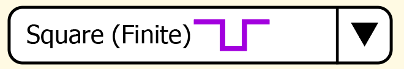

**Screens:**

All (options vary by screen)

Screen 1 One Well

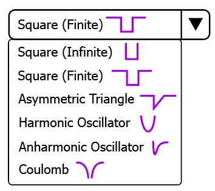

Screen 2 Two Wells

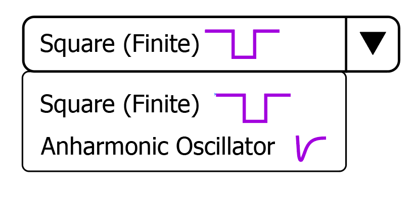

Screen 3 Many Wells


Screen 4 Superposition

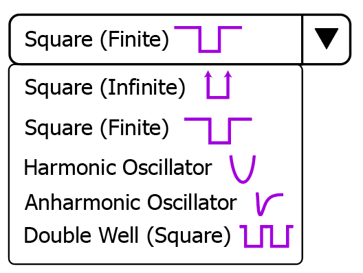

**Component Description:**

Select the potential shape for the energy graph

Contains horizontal lines for discrete levels that can be selected with the pointer. Selected level is highlighted with additional shaped cues at the ends (triangular shape in mockup) (thicker line or glow).

**Pedagogical significance:**

Lets learners compare how different potentials shape bound states and connect model choices to physical systems.

**Initial State:**

One Well: Square (Infinite)
Two Wells: Square (Finite)
Many Wells: Square (Finite)
Superposition: Square (Infinite)

**Design questions (default behavior):**

- Should changing the potential type reset the selected energy level, mass, and display graph mode, or preserve them when possible?
  - TBD

**Adjustable values:**

Options by screen:

One Well = Square (Infinite), Square (Finite), Asymmetric Triangle, Harmonic Oscillator, Anharmonic Oscillator, Coulomb.

Two Wells = Square (Finite), Anharmonic Oscillator (double well).

Many Wells = Square (Finite).

<!-- May include anharmonic oscillator for Many Wells, TBD -->

Superposition = Square (Infinite), Square (Finite), Harmonic Oscillator, Anharmonic Oscillator, Square (Double Well).

**Pointer behavior:**

Click a dropdown option to select.

**Keyboard behavior:**

Arrow keys move within the group; Space selects.

**Tab order notes:**

First in tab order on all screens.

Selected/unselected; focused; hover/pressed.

**Motion/animation:**

None (switch updates immediately).

**Accessibility strings (Core Description):**

```yaml
accessibleName: "Potential Type".

accessibleHelpText: "Choose a potential shape for the energy graph."

accessibleName (options): "Square (Infinite)", "Square (Finite)", "Asymmetric Triangle", "Harmonic Oscillator", "Anharmonic Oscillator", "Coulomb", "Double Well"

accessibleObjectResponse: "potential set to {option}"
```

**Visual ordering/overlap:**

Energy level lines are drawn below the potential curve.

**Edge cases:**

TBD: Switching potential resets height, width, and separation to defaults for that type.

Loss of the selected energy level always chooses the ground state (E1) to fall back on.

**Sound design:**

Default dropdown menu selection sound.

### 3.13 Energy Graph (upper graph)

**Component Type:**

Graph

**Mockup image:**

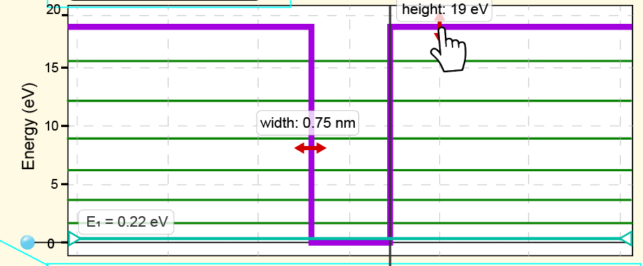

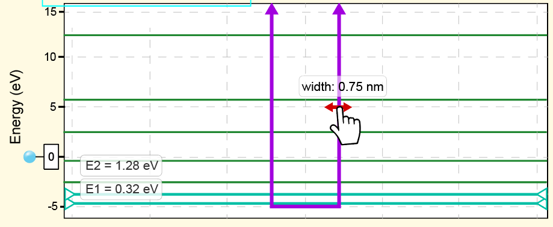

**Screens:**

All

**Component Description:**

Display the potential curve with energy levels or bands and allow pointer selection of levels where applicable.

**Pedagogical significance:**

Visualizes the potential landscape and quantized energies or bands, linking boundary conditions to discrete spectra.

**Initial State:**

TBD

**Design questions (default behavior):**

- What is the default energy level selection, and should clicking empty space clear the selection or keep the last chosen level?
- Should the energy axis auto-rescale when parameters change, or stay fixed to preserve comparisons?
- When energy bands appear, should the graph indicate the transition with a label or only disable selection?

**Adjustable values:**

Axes: Position (nm) on x-axis and Energy (eV) on y-axis. Ranges adjust to keep the full potential and relevant levels in view (TBD confirm default ranges).

Display-only; reflects current state.

**Pointer behavior:**

Hover highlights energy lines brightens and increase stroke width. Clicking a line selects the corresponding level on One Well, Two Wells, and Many Wells, adds triangles either end of the energy level. On Superposition, energy lines are reference only.

**Keyboard behavior:**

Energy lines are not focusable; selection is via the Energy level selector where available, but the same visual change to energy line happens on selected line (triangles + color change).

**Tab order notes:**

N/A

Hover highlight on energy lines; no drag on lines.

**Motion/animation:**

Lines update immediately as parameters change.

**Accessibility strings (Core Description):**

```yaml
accessibleHeading: "Energy Graph".

accessibleParagraph: "Shows the potential curve and energy levels. When levels are selectable, the Energy level selector and the energy lines choose the same state."
```

**Visual ordering/overlap:**

Potential curve in front of energy lines; handles in front of energy lines; reference line draws above overlays; magnifier draws above everything.

**Edge cases:**

TBD

**Sound design:**

None.

### 3.14 Well Height Handle

**Component Type:**

Drag Handle

**Mockup image:**

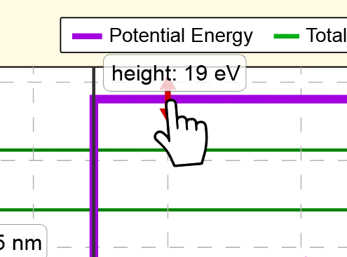

**Screens:**

All screens (depending on potential type)

**Component Description:**

Adjust the vertical height of the potential well.

**Pedagogical significance:**

Shows how well depth controls confinement strength and the number and spacing of bound states.

**Initial State:**

TBD

**Design questions (default behavior):**

- What is the default well height for each screen, and should it snap to meaningful values (e.g., legacy defaults)?
- Should height changes re-center the graph or keep the bottom anchored for visual consistency?
- Do we show a value readout while dragging, and if so, should it persist after release?

**Adjustable values:**

Legacy ranges:

Square/Asymmetric/Anharmonic well height 0 to 20 eV, default 10 eV. Step 0.1 eV for keyboard changes.

Height handle is hidden for potentials that do not define a well height.

Well height value.

**Pointer behavior:**

Drag vertically to increase or decrease well height; the bottom of the well stays anchored near the bottom of the energy graph. Horizontal motion is ignored.

**Keyboard behavior:**

Arrow Up/Down adjusts by large increments; Shift + Arrow Up/Down for smaller steps.

**Tab order notes:**

In the tab order when a height handle is shown for the current potential; removed when height is not adjustable.

**Motion/animation:**

Handle follows pointer/keyboard; value text highlight updates in real time.

**Accessibility strings (Core Description):**

```yaml
accessibleName: "Well Height".

accessibleHelpText: "Move up to increase well height or down to decrease it."

accessibleObjectResponse: "well height {value} electronvolts"

accessibleContextResponse: "Higher wells can support more bound states."
```

**Visual ordering/overlap:**

Handles render above the potential curve and energy lines In front of reference line. Behind magnifier probe.

**Edge cases:**

If height changes reduce available bound states, the selected energy index clamps to E1.

**Sound design:**

None.

### 3.15 Well Width Handles

**Component Type:**

Drag Handle

**Mockup image:**

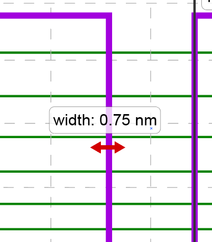

**Screens:**

One Well, Two Wells, Many Wells, Superposition

**Component Description:**

Adjust the horizontal width of the well.

**Pedagogical significance:**

Illustrates how spatial confinement changes energy spacing and wave function extent.

**Initial State:**

TBD

**Design questions (default behavior):**

- What is the default well width, and should both handles move symmetrically by default?
- Do we allow widths below a minimum pixel/physical size, or clamp to preserve readability?
- Should width changes preserve the well center or anchor to one side?

**Adjustable values:**

Legacy ranges by screen:

One Well and Superposition = 0.1 to 6 nm, default 1.0 nm.

Two Wells = 0.1 to 3 nm, default 1.0 nm.

Many Wells = 0.1 to 0.5 nm, default 0.5 nm. Step 0.1 nm.

On Superposition, width is further clamped as needed to keep at least three bound states visible.

**Pointer behavior:**

Drag left/right; both sides move symmetrically around the well center.

**Keyboard behavior:**

Arrow Left/Right adjusts by large increments; Shift + Arrow Left/Right for smaller steps.

**Tab order notes:**

In the tab order when width handles are shown; removed when width is locked by a preset.

**Motion/animation:**

Handles move with pointer/keyboard; value text updates live.

**Accessibility strings (Core Description):**

```yaml
accessibleName: "Well Width".

accessibleHelpText: "Move left to narrow the well or right to widen it."

accessibleObjectResponse: "well width {value} nanometers"

accessibleContextResponse: "Wider wells can support more bound states and smaller energy spacing."
```

**Visual ordering/overlap:**

Handles render above the potential curve and energy lines In front of reference line. Behind magnifier probe.

**Edge cases:**

On Superposition, width is clamped so at least three bound states remain visible.

If width changes reduce available bound states, the selected energy index clamps to E1.

**Sound design:**

None.

### 3.16 Well Separation Handle

**Component Type:**

Drag Handle

**Mockup image:**

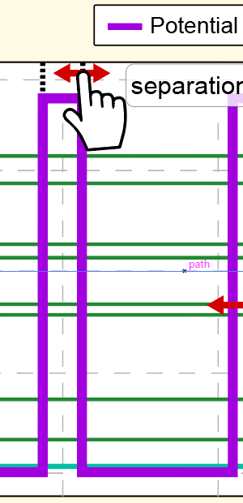

**Screens:**

Two Wells, Many Wells

**Component Description:**

Adjust the distance between neighboring wells.

**Pedagogical significance:**

Highlights tunneling and splitting into bonding and antibonding states as wells couple.

**Initial State:**

Dependent on selected well.

**Design questions (default behavior):**

- What is the default separation between wells, and should zero separation be allowed?
- Should the separation handle snap to a small set of pedagogically meaningful distances?
- When separation changes, should selected energy levels persist or reset to the nearest valid level?

**Adjustable values:**

Legacy ranges:

Two Wells (Square) = 0.05 to 0.7 nm, default 0.1 nm.

Many Wells (Square) = 0.05 to 0.2 nm, default 0.1 nm.

Coulomb/spacing range (when applicable) = 0.05 to 0.7 nm, default 0.7 nm.

Step 0.01 nm.

Well separation value.

**Pointer behavior:**

Drag left/right to decrease/increase separation.

**Keyboard behavior:**

Arrow Left/Right adjusts by small increments; Shift + Arrow Left/Right for larger steps.

**Tab order notes:**

In the tab order on Two Wells and Many Wells when the separation handle is shown.

Focused, hover, dragged.

**Motion/animation:**

Handle follows pointer; value text updates live.

**Accessibility strings (Core Description):**

```yaml
accessibleName: "Well Separation".
accessibleHelpText: "Move left to bring wells closer or right to move them apart."
accessibleObjectResponse: "well separation {value} nanometers"
accessibleContextResponse: "Smaller separation increases tunneling and energy splitting."
```

**Visual ordering/overlap:**

Handle and value text render above the potential curve.

**Edge cases:**

TBD

**Sound design:**

TBD

### 3.17 Energy Offset Handle

**Component Type:**

Drag Handle

**Mockup image:**

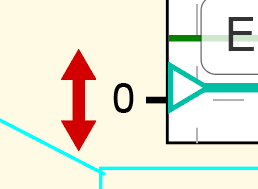

**Screens:**

Many Wells only

**Component Description:**

Shift the entire periodic potential up or down, by moving the Y-axis on the energy graph.

**Pedagogical significance:**

Separates absolute energy reference from relative spacing, supporting interpretation of energy shifts. Changing the energy offset will change the time dependence of the wave function.

**Initial State:**

TBD

**Design questions (default behavior):**

- What is the default energy offset, and should it reset to 0 on screen reset or on potential change?
- Should the offset handle show a numeric value on drag or only when Value Labels is enabled?
- Do we clamp offset to keep the potential fully in view, or allow it to move off-screen?

**Adjustable values:**

Legacy ranges:

Square/Asymmetric/Harmonic/Anharmonic offset = -5 to 15 eV, default 0 eV.

Coulomb offset on One Well = -15 to 5 eV, default 0 eV.

Step 0.1 eV.

**Pointer behavior:**

Drag vertically to shift the potential baseline.

**Keyboard behavior:**

Arrow Up/Down adjusts by large increments; Shift + Arrow Up/Down for smaller steps.

**Tab order notes:**

In the tab order on Many Wells only (when offset is enabled).

Focused, hover, dragged.

**Motion/animation:**

Handle follows pointer; value text updates live.

**Accessibility strings (Core Description):**

```yaml
accessibleName: "Energy Offset".

accessibleHelpText: "Move up or down to shift the potential baseline."

accessibleObjectResponse: "energy offset {value} electronvolts"
```

**Visual ordering/overlap:**

Handle renders above the potential curve and energy lines.

**Edge cases:**

When offset makes the potential too shallow, bound states may disappear; selection clamps accordingly.

**Sound design:**

None.

### 3.18 Magnifier Tool (draggable probe)

**Component Type:**

??? MagnifierNode (scenery-phet), 2D draggable object with zoomed-in view

**Mockup image:**

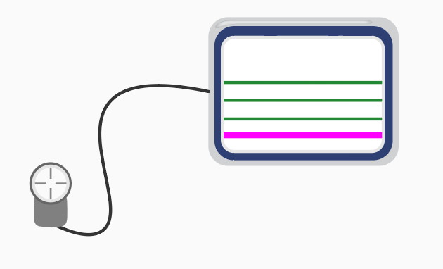

**Screens:**

All (visible only when Magnifier toggle is on)

**Component Description:**

Provide a zoomed-in probe for inspecting fine features in the energy graph.

**Pedagogical significance:**

Supports close inspection of nodes, curvature, and tunneling to connect shape to behavior.

**Initial State:**

View is anchored to the top right of the Energy Graph. The probe should be placed in the middle of the well, centered on the 1st energy level.

**Design questions (default behavior):**

**Adjustable values:**

Position within the graph (x in nm, y in eV). Default centered over the wells. Step 0.1 nm / 0.1 eV for keyboard moves.

**Pointer behavior:**

Drag lens probe within the graph bounds; constrained so the lens does not exit the plot region.

{TBD: CAN WE MOVE THE ZOOMED-IN DISPLAY PORTION? My intuition is to leave it where it in the top right of the energy graph}

**Keyboard behavior:**

Space/Enter grabs probe; Arrow keys move; Space/Enter releases.

{TBD: Does escape do anything for other draggables?}

**Tab order notes:**

In the tab order only when the Magnifier toggle is on; removed when magnifier is off.

**Motion/animation:**

Lens probe follows pointer/keyboard; no easing specified.

**Accessibility strings (Core Description):**

```yaml
accessibleName: "Magnifier".

accessibleHelpText: "Move the magnifier across the graph to visually inspect closely spaced energy levels."

{TBD: is there an object response we can cleanly convey...?}
```

**Visual ordering/overlap:**

Lens probe renders above potential, energy lines. Above reference line.

**Edge cases:**

If magnifier is hidden and then shown again, it returns to its last position.

**Sound design:**

None.

### 3.19 Display Graph

**Mockup image:**

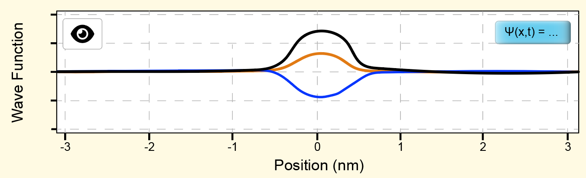

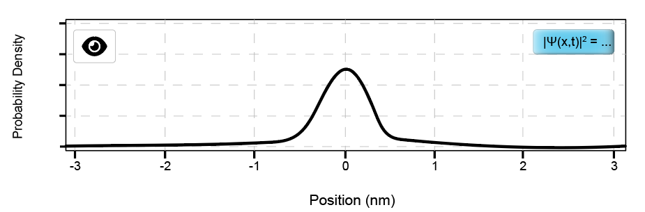

**Screens:**

All (visible only when Display Graph is shown)

**Component Description:**

Display probability density, average probability density of a band, or wave function parts.

**Pedagogical significance:**

Connects selected energies to wave function or probability density shapes and their time behavior.

**Initial State:**

Visible. Shows the selected energy level (E1 unless customized). Starts on Probability Density. {TBD: Legacy sim also begins on Prob Density on Many Wells tab rather than on Average Probability Density of Band.}

On superposition screen, shows the 1st preset (cPsi1 + cPsi2)

**Design questions (default behavior):**

- What is the default display graph mode per screen, and should it persist when switching screens?
- Should the display graph auto-rescale to fit the current state, or keep a fixed scale to compare changes?
- When the display graph is hidden, should its state (mode/parts) still update in the background or pause?

**Adjustable values:**

Display type and wave function parts are controlled by the Display Graph Radio Button Group and Wave Function Part toggles.

**Pointer behavior:**

None (display only).

**Keyboard behavior:**

Focusable reading block; no direct interaction.

**Tab order notes:**

Heading and reading block are in the tab order when the Display Graph is visible; removed when hidden.

Focused reading block only.

**Motion/animation:**

Updates continuously when playing; static when paused.

**Accessibility strings (Core Description):**

```yaml
accessibleHeading: "Display Graph".

accessibleParagraph: "Shows {display type} for the selected state. Parts shown: {parts list}." (Dynamic string based on current display and toggles.)
```

**Visual ordering/overlap:**

Drawn below the energy graph; does not overlap the main graph.

**Edge cases:**

When hidden, Screen Summary details omit display graph descriptions.

**Sound design:**

None.

### 3.20 Display Graph Visibility Toggle

**Component Type:**

Checkbox (phet/sun)

**Mockup image:**

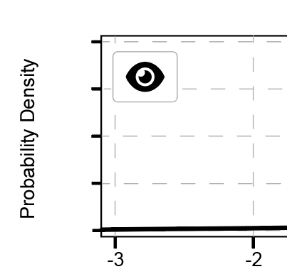

**Screens:**

All

**Component Description:**

Show or hide the display graph region.

**Pedagogical significance:**

Allow instructors to set up scenarios for students to determine characteristics of the probability density or wave function before revealing.

**Initial State:**

Graph Visible

**Design questions (default behavior):**

- Should the display graph be visible by default on every screen, or only on specific screens?
  - All screens
- Should the visibility toggle remember state per screen or globally?

**Adjustable values:**

Boolean (shown/hidden). Default: shown.

Display graph visibility.

**Pointer behavior:**

Click to toggle.

**Keyboard behavior:**

Space/Enter toggles when focused.

**Tab order notes:**

**Motion/animation:**

Graph appears/disappears immediately; no custom animation specified.

**Accessibility strings (Core Description):**

```yaml
accessibleName: "Display Graph Visibility". {TBD: need better name...}

accessibleHelpText: "Show or hide the display graph."

accessibleContextResponseChecked: "Display graph shown."

accessibleContextResponseUnchecked: "Display graph hidden."
```

**Visual ordering/overlap:**

N/A.

**Edge cases:**

When hidden, need to change the description of the Display Graph in the Screen Summary to omit details about the graph.

**Sound design:**

None.

### 3.21 Equation Button

**Component Type:**

TextPushButton (phet/sun)

**Mockup image:**

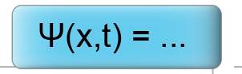

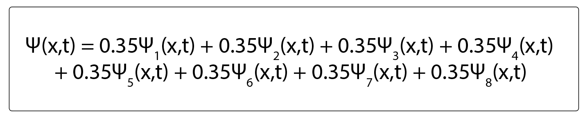

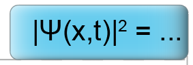

**Screens:**

All

**Component Description:**

Open the Equation Details dialog.

**Pedagogical significance:**

Links the visual graph to the mathematical form of the wave function psi(x,t) or probability density |psi(x,t)|^2.

**Initial State:**

Closed until Equation button is pressed.

**Design questions (default behavior):**

- If the display graph is hidden, should the equation button be hidden or disabled?
  - Still visible.

**Adjustable values:**

On/off state for the overlay. Button label changes with display: "psi(x,t)" when the Display Graph shows Wave Function; "|psi(x,t)|^2" when the Display Graph shows Probability Density

TBD: Text on button for Average Probability Density. Could be "|psi(x,t)|^2/n" or dynamic with n = number of wells. Legacy sim shows the number of wells with a truncated equation.

Default: off.

**Pointer behavior:**

Click toggles the overlay. When turning on, opens the Equation Details dialog.

**Keyboard behavior:**

Space/Enter toggles; turning on opens the dialog. Escape closes the dialog.

**Tab order notes:**

In the tab order when the Display Graph is shown; disabled/removed when the Display Graph is hidden.

On/off; focused; hover/pressed; disabled when the Display Graph is hidden.

**Motion/animation:**

Overlay appears/disappears immediately (no custom animation specified).

**Accessibility strings (Core Description):**

```yaml
accessibleName: "psi(x,t) equation" / "|psi(x,t)|^2 equation / TBD: Average Prob Equation" (matches current display).

accessibleHelpText: "Show or hide the equation overlay and open the equation details dialog."

accessibleContextResponseOn: "Equation shown."

accessibleContextResponseOff: "Equation hidden."
```

**Visual ordering/overlap:**

Equation overlay renders above the Display Graph plot and below focus outlines.

**Edge cases:**

When the display mode changes, the button label and overlay update to match. When the Display Graph is hidden, the overlay hides and the button is disabled.

**Sound design:**

None.

### 3.22 Reference Line (draggable)

**Component Type:**

2D draggable object

**Mockup image:**

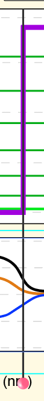 

**Screens:**

All (visible only when Reference Line toggle is on)

**Component Description:**

Provide a movable vertical reference line for comparing potential boundaries to probability density/wave function envelope.

**Pedagogical significance:**

Supports analysis of spatial relationships between potential features and wave function behavior, such as tunneling locations and node positions.

**Initial State:**

Aligned with 0 nm on the position axis.

**Design questions (default behavior):**

- When the reference line is toggled off and back on, should it restore its last position or reset?
  - Restore last position until Reset All or page reload.

**Adjustable values:**

Range follows the graph position axis. Step 0.1 nm for keyboard changes. Default at 0 nm.

**Pointer behavior:**

Drag left/right within graph bounds.

**Keyboard behavior:**

Space/Enter grabs; Arrow Up/Down adjusts; Shift + Arrow for smaller steps; Space/Enter releases; Escape cancels.

**Tab order notes:**

In the tab order only when the Reference Line toggle is on; removed when off.

**Motion/animation:**

Line follows pointer/keyboard with no custom easing.

**Accessibility strings (Core Description):**

```yaml
accessibleName: "Reference Tool". (TBD: better name, unique from the tool itself?)

accessibleHelpText: "Move across graphs to set a reference position."

accessibleObjectResponse: "reference position at {value} nanometers"
```

**Visual ordering/overlap:**

Line renders above the potential curve and energy lines, below the magnifier lens.

**Edge cases:**

When hidden and shown again, the line returns to its previous value.

**Sound design:**

None.

### 3.23 Magnifier Tool Toggle

**Component Type:**

Checkbox (phet/sun)

**Mockup image:**


**Screens:**

All

**Component Description:**

Show or hide the magnifier tool in the energy graph.

**Pedagogical significance:**

Lets learners opt into detailed inspection to explore fine spatial features.

TBD

**Initial State:**

TBD

**Design questions (default behavior):**

- Should the magnifier toggle default to off, and should it remember the last position when re-enabled?
- Should enabling the magnifier auto-open the Display Graph if it is hidden?
- Do we need a default magnifier zoom level, or will it be fixed?

**Adjustable values:**

Boolean (shown/hidden). Default: off.

Magnifier visibility.

**Pointer behavior:**

Click to toggle.

**Keyboard behavior:**

Space/Enter toggles when focused.

**Tab order notes:**

Always in the tab order (control panel).

Checked/unchecked; focused; hover/pressed.

**Motion/animation:**

Magnifier appears/disappears immediately.

**Accessibility strings (Core Description):**

```yaml
accessibleName: "Magnifier".

accessibleHelpText: "Show or hide the magnifier."

accessibleContextResponseChecked: "Magnifier shown."

accessibleContextResponseUnchecked: "Magnifier hidden."
```

**Visual ordering/overlap:**

N/A.

**Edge cases:**

When turned off while the magnifier is grabbed, it releases and hides.

**Sound design:**

None.

### 3.24 Reference Line Toggle

**Component Type:**

Checkbox (phet/sun)

**Mockup image:**


**Screens:**

All

**Component Description:**

Show or hide the vertical reference line to compare position of potential well and wave function/probability density.

**Pedagogical significance:**

Supports analysis of spatial relationships between potential features and wave function behavior, such as tunneling locations and node positions.

**Initial State:**

Default unchecked

**Design questions (default behavior):**

- Should the reference line default to off, and should it reopen at the last value or a default value?
  - Default unchecked, should save last position of the reference line per screen until Reset All for that screen or reload (for all screens).

**Adjustable values:**

Boolean (shown/hidden). Default: off.

Reference line visibility.

**Pointer behavior:**

Click to toggle.

**Keyboard behavior:**

Space/Enter toggles when focused.

**Tab order notes:**

Always in the tab order (control area).

**Motion/animation:**

Line appears/disappears immediately.

**Accessibility strings (Core Description):**

```yaml
accessibleName: "Reference Tool". (TBD: better name, unique from the tool itself?)

accessibleHelpText: "Show or hide the vertical position reference line across the energy and display graphs."

accessibleContextResponseChecked: "Reference line shown."

accessibleContextResponseUnchecked: "Reference line hidden."
```

**Visual ordering/overlap:**

TBD: Above everything???

**Edge cases:**

When turned off and on, the line returns to its last value. Position reset with reset all.

**Sound design:**

Standard checkbox sound.

### 3.25 Timer Accordion Box

**Component Type:**

AccordionBox (phet/sun)

**Mockup image:**

 

**Screens:**

All

**Component Description:**

Show or hide the simulation time readout by expanding/collapsing the timer accordion.

**Pedagogical significance:**

Supports attention to time evolution and encourages pausing to interpret dynamic behavior.

**Initial State:**

Expanded by default.

**Design questions (default behavior):**

- Should the timer state (expanded/collapsed) persist across screen changes?
  - Per screen setting, always start expanded.

**Adjustable values:**

Expanded/collapsed state (shown/hidden). Default: expanded. Units in femtoseconds (fs). Time readout scale changes by factors of 10 based on the Speed slider.

Timer accordion expanded/collapsed state.

**Pointer behavior:**

Click the accordion header to expand/collapse.

**Keyboard behavior:**

Space/Enter toggles when focused.

**Tab order notes:**

Always in the tab order before the Time Controls.

Expanded/collapsed; focused; hover/pressed.

**Motion/animation:**

Accordion expands/collapses; time readout appears/disappears immediately.

**Accessibility strings (Core Description):**

```yaml
accessibleName: "Timer".

accessibleHelpTextExpanded: "Hide the simulation time readout."

accessibleHelpTextCollapsed: "Show the simulation time readout."

accessibleObjectResponseExpanded: "{timeInFemtoseconds} femtoseconds". (on focus)

accessibleObjectResponseCollapsed: "Timer hidden." (on focus)
```

**Visual ordering/overlap:**

N/A.

**Edge cases:**

When collapsed, the time readout is removed from the accessibility tree.

**Sound design:**

None.

### 3.26 Time Controls (Restart, Play/Pause, Step)

**Component Type:**

TimeControlNode (scenery-phet)

**Mockup image:**

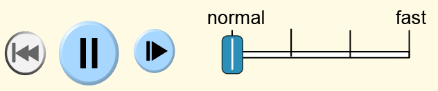

**Screens:**

All

**Component Description:**

Control simulation time evolution. Includes Play/Pause toggle, Step button, and Restart button.

**Pedagogical significance:**

Enables controlled observation of time-dependent behavior and stepwise phase evolution.

**Initial State:**

Playing, timer incrementing. Step button only available when paused.

**Design questions (default behavior):**

- When key parameters change (potential, mass), should time restart or continue?
  - It should restart.

**Adjustable values:**

Play/Pause (boolean). Step advances by last digit of the current speed's time increment. Restart Simulation returns time to t = 0 without changing parameters.

From legacy sim:

1. (normal) 0.01 per step
2. 0.1 per step
3. 1 per step
4. (fast) 10 per step

Playing state, simulation time.

**Pointer behavior:**

Click buttons.

**Keyboard behavior:**

Space/Enter activates buttons.

**Tab order notes:**

Always in the tab order (control panel).

Focused, hover, pressed, disabled (Step disabled while playing).

**Motion/animation:**

No animation; time evolution speed changes immediately.

**Accessibility strings (Core Description):**

```yaml
- Use common code

{TBD - language around step?}

```

**Visual ordering/overlap:**

N/A.

**Edge cases:**

Restart does not change parameters, potential type, or superposition coefficients. Step is disabled while playing.

**Sound design:**

Default UI click sounds only.

### 3.26a Speed Slider

**Component Type:**

Slider

**Mockup image:**


**Screens:**

All

**Component Description:**

Adjust the simulation speed and the scale of the timer readout.

**Pedagogical significance:**

Lets learners speed up time-dependent behavior to see long-term patterns.

**Initial State:**

Normal.

**Design questions (default behavior):**

-

**Adjustable values:**

Four discrete speeds: Normal, Fast, Faster, Fastest. Each increment multiplies the timer scale by 10 (Normal = 1x, Fast = 10x, Faster = 100x, Fastest = 1000x) (or whatever the model demands)

Speed selection (discrete).

**Pointer behavior:**

Drag thumb or click a tick to jump to a speed.

**Keyboard behavior:**

Arrow Left/Right steps between speeds; Home/End jumps to minimum/maximum.

**Tab order notes:**

In the tab order after Step and before Reset All.

**Motion/animation:**

Slider thumb moves; speed change applies immediately.

**Accessibility strings (Core Description):**

```yaml
accessibleName: "Sim Speeds"

accessibleHelpText: "Increase the simulation speed for slowly evolving energy states."

```

**Visual ordering/overlap:**

N/A.

**Edge cases:**

Changing speed restarts the current time to 0.

**Sound design:**

Default slider sound.

### 3.27 Reset All Button

**Component Type:**

ResetAllButton (scenery-phet)

**Mockup image:**

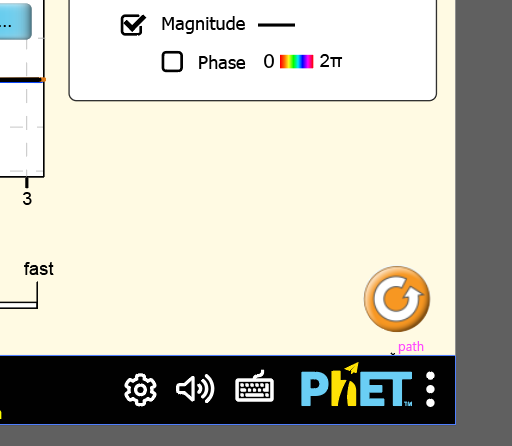

**Screens:**

All

**Component Description:**

Restore all parameters and state to their initial values on a given screen.

**Pedagogical significance:**

Supports iterative experimentation by restoring a known baseline state.

**Initial State:**

TBD

**Design questions (default behavior):**

TBD: Reset All also clears custom superposition edits and returns to default preset/mode?

**Adjustable values:**

N/A (button).

Resets all saved state to defaults (or to loaded state baseline).

**Pointer behavior:**

Click to reset all.

**Keyboard behavior:**

Space/Enter activates when focused.

**Tab order notes:**

Always in the tab order (control panel).

Focused, hover, pressed; always enabled.

**Motion/animation:**

None.

**Accessibility strings (Core Description):**

Common code descriptions.

**Visual ordering/overlap:**

N/A.

**Edge cases:**

**Sound design:**

Standard reset sound (if any).

### 3.28 Equation Details Dialog

**Component Type:**

Dialog (phet/sun)

**Mockup image:**

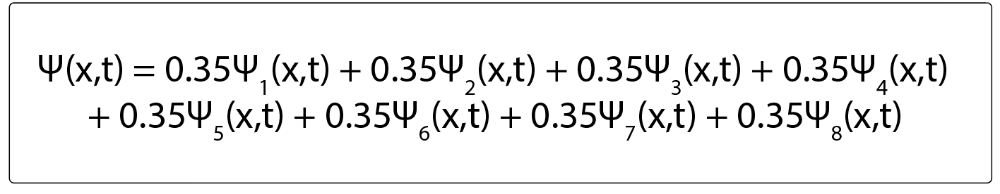

**Screens:**

All (opened from the Equation button)

**Component Description:**

Show the full equation for the currently selected eigenstate or probability density.

**Pedagogical significance:**

Deepens the link between a selected state and its full mathematical expression.

**Initial State:**

Not visible until Equation button is pressed.

**Design questions (default behavior):**

- Should the equation details dialog open at a fixed size/position or near the Equation button?
  - Centered.
- Is the dialog allowed to be open when the display graph is hidden?
  - Yes.

**Adjustable values:**

Dialog open/close state is transient and not saved.

**Pointer behavior:**

Close (X) button or click off dialog to close.

**Keyboard behavior:**

Dialog traps focus; Esc closes.

**Tab order notes:**

Not in the tab order unless the dialog is open; when open, focus is trapped within the dialog.

**Motion/animation:**

None (standard dialog open/close).

**Accessibility strings (Core Description):**

```yaml
accessibleName: "Equation Details".

accessibleHelpText: "Dialog showing the full equation for the current state."
```

**Visual ordering/overlap:**

Modal dialog above all content; background dimmed.

**Edge cases:**

On the Superposition screen, the dialog shows the full superposition expression rather than a single eigenstate.

**Sound design:**

None.

### 3.29 Superposition Details Preview Dialog

**Component Type:**

Dialog (phet/sun)

**Mockup image:**

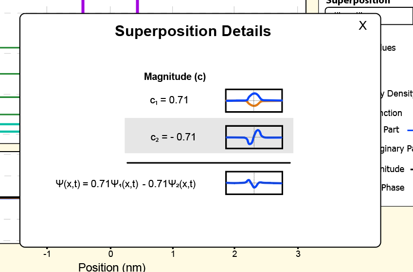

**Screens:**

Superposition

**Component Description:**

Present a read-only list of coefficient magnitudes and phases for the active superposition (phases shown in units of π).

**Pedagogical significance:**

Connects a coefficient list to the resulting spatial and temporal structure before committing changes.

**Initial State:**

Not visible until the Superposition Details button is pressed.

**Design questions (default behavior):**

- Should the preview dialog default to a specific representation (wave function vs probability)?
  - No, it should always show the wave function. {TBD: confirm}
- Should it update live if the selected superposition changes while the dialog is open?
  - Dialog can't be open if changing superposition.
- Do we want a default location for the dialog to avoid covering the display graph?
  - Centered in the window for now.

**Adjustable values:**

N/A (read-only).

N/A (read-only view).

**Pointer behavior:**

Close button only.

**Keyboard behavior:**

Tab moves within dialog; Escape closes.

**Tab order notes:**

Not in the tab order unless the dialog is open; when open, focus is trapped within the dialog.

Focused close button; otherwise reading content only.

**Motion/animation:**

None.

**Accessibility strings (Core Description):**

```yaml
accessibleName: "Superposition Details".

{TBD: accessibleHelpText and other strings}
```

**Visual ordering/overlap:**

Modal dialog above all content; background dimmed.

**Edge cases:**

If coefficients change while the dialog is open, the list updates immediately.

**Sound design:**

None.

### 3.30 Superposition Customize Dialog

**Component Type:**

Dialog (phet/sun)

**Mockup image:**

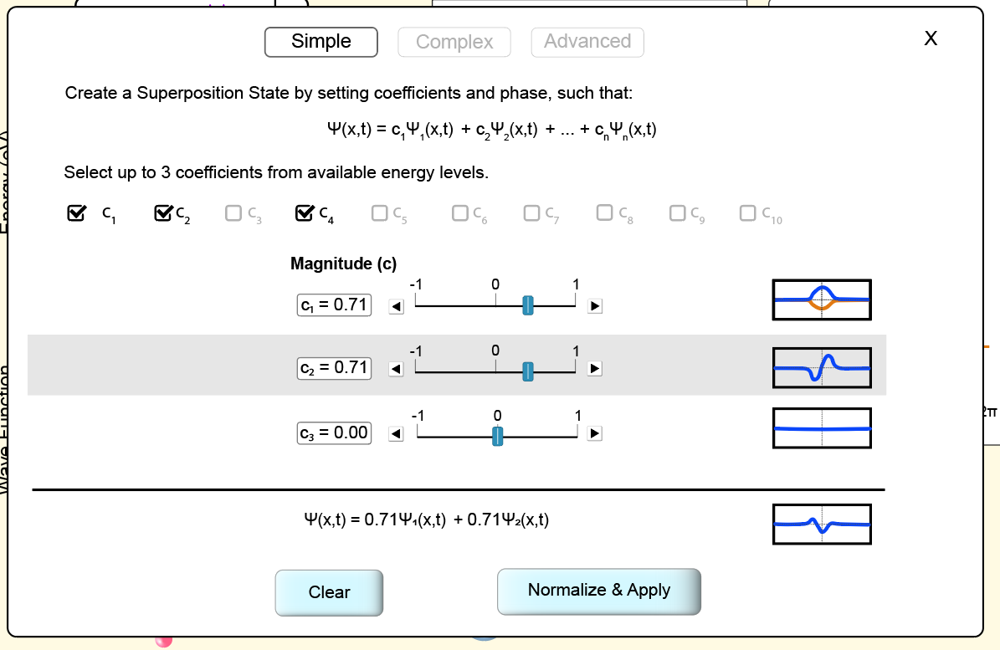
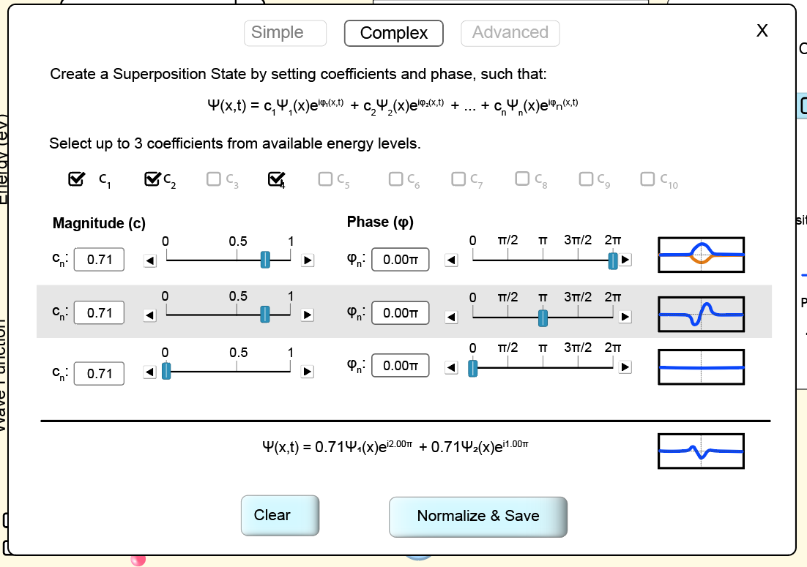
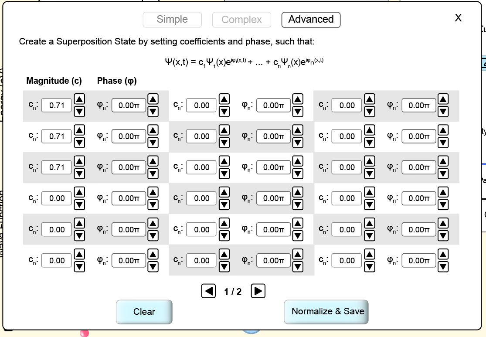

**Screens:**

Superposition

**Component Description:**

Allow editing of coefficient magnitudes and phases for a custom superposition.

**Pedagogical significance:**

Provides structured exploration of how amplitudes and phases shape interference and dynamics.

**Initial State:**

n/a

**Design questions (default behavior):**

- What are the default coefficient and phase values when opening a new Custom state?
  - cPsi1 + cPsi2 + cPsi3 with equal magnitudes and zero phases?
- Should the dialog warn or prevent invalid combinations (e.g., all zeros)?
- It will prevent the Normalize and Save button when all coefficients are set to zero. Phases can be zero.

**Adjustable values:**

Mode selector (Radio buttons or "Tabs" - NOTE: Tabs live in `joist`, not in `scenery`): Simple, Complex, Advanced. The dialog edits the currently selected Custom slot (Custom 1-5).

Simple mode: up to three coefficient sliders from -1.00 to 1.00, with a preview of each contribution to the wave function graph.

Complex mode: up to three magnitude sliders from 0.00 to 1.00 plus a phase slider from 0.00π to 2.00π (displayed in units of π with two decimals; model uses radians under the hood), with a preview of each contribution to the wave function graph.

Advanced mode: number controls for coefficients (0.00 to 1.00) and phases (0.00π - 1.00π) for each possible eigenstate, with no preview display.

Provide Normalize and Save plus Clear buttons. Saving writes to the currently selected Custom slot.

Custom coefficient values and selected eigenstate indices (saved as part of state).

**Pointer behavior:**

Click the mode selector to switch Simple/Complex/Advanced. Drag sliders or use spinners to set coefficients and phases. Click Save or Cancel.

**Keyboard behavior:**

Tab through controls; arrow keys adjust sliders and spinners; Space/Enter activates buttons; Escape cancels.

**Tab order notes:**

Not in the tab order unless the dialog is open; when open, focus is trapped within the dialog.

Focused controls; hover/pressed; disabled controls for removed eigenstates.

**Motion/animation:**

None beyond standard dialog open/close.

**Accessibility strings (Core Description):**

```yaml
accessibleName: "Customize Superposition {customSlotNumber}".

# Mode selection 
accessibleName (mode options): "Simple", "Complex", "Advanced".
accessibleObjectResponse (mode selector): "mode set to {mode}"

# Simple
{TBD: accessibleHelpText and other strings}

# Complex
{TBD: accessibleHelpText and other strings}

# Advanced
{TBD: accessibleHelpText and other strings}

```

**Visual ordering/overlap:**

Modal dialog above all content; background dimmed.

**Edge cases:**

Switching modes preserves the current coefficient values; when a mode cannot display all states (Simple/Complex), it shows up to three active eigenstates. If all magnitudes are set to zero, disable Save and prompt the user to select at least one state.

**Sound design:**

None.

### 3.30a Coefficient Checkboxes (Simple/Complex)
  
  **Component Type:**
  
  CheckboxGroup (phet/sun)
  
  **Mockup image:**
  
  
  
  **Screens:**
  
  Superposition (Customize dialog)
  
  **Component Description:**
  
  Enable or disable a coefficient term so learners can isolate contributions.
  
  **Pedagogical significance:**
  
  Highlights how individual eigenstates contribute to the overall superposition.
  
  **Initial State:**
  
  From current custom state (e.g., cPsi1 + cPsi2 has Psi1 and Psi2 checked).
  
  **Design questions (default behavior):**
  
- Should unchecked coefficients be treated as exact zero or merely hidden?
- When a checkbox is turned on, should its coefficient default to a small nonzero value?
  
  **Adjustable values:**
  
  On/off per eigenstate term (limited to visible terms in Simple/Complex; all terms in Advanced).

  Up to 10 checkboxes visible. Up to 3 checkboxes can be checked at a time.
  
  **Pointer behavior:**
  
  Click to toggle each coefficient term on or off.
  
  **Keyboard behavior:**
  
  Tab to a checkbox, Space toggles.
  
  **Tab order notes:**
  
  Appears after mode selector and before sliders/spinners for the same term.
  
  **Motion/animation:**
  
  None.
  
  **Accessibility strings (Core Description):**
  
```yaml
accessibleName: "Include eigenstate term".

accessibleHelpText: "Toggle whether this eigenstate contributes to the superposition."

accessibleObjectResponse: "Included." / "Excluded."
```

  **Visual ordering/overlap:**
  
  Checkbox rows align with their corresponding sliders/spinners.
  
  **Edge cases:**
  
  If all coefficients are unchecked, disable Normalize and Save button.

  If 3 coefficients are already checked, disable additional checkboxes until one is unchecked.
  
  **Sound design:**
  
  Default checkbox sound.
  
### 3.30b Coefficient Magnitude Sliders (Simple/Complex)

  **Component Type:**
  
  HSlider (phet/sun)
  
  **Mockup image:**
  
  
  
  **Screens:**
  
  Superposition (Customize dialog, Simple/Complex)
  
  **Component Description:**
  
  Adjust coefficient magnitude for selected eigenstate terms.
  
  **Pedagogical significance:**
  
  Supports exploration of how amplitude weights affect interference and localization.
  
  **Initial State:**
  
  TBD (from current Custom state).
  
  **Design questions (default behavior):**
  
- Should sliders renormalize other terms automatically or leave totals unnormalized until Save?
- Should the slider range be symmetric in Simple mode (-1.00 to 1.00) and nonnegative in Complex mode (0.00 to 1.00)?
- Should sliders snap to 0.00 and 1.00 for quick extremes?
  
  **Adjustable values:**
  
  Simple mode: -1.00 to 1.00 (signed coefficient).
  
  Complex mode: 0.00 to 1.00 (magnitude).
  
  **Pointer behavior:**
  
  Drag handle; click track to jump.
  
  **Keyboard behavior:**
  
  Arrow keys adjust; Shift for larger steps.
  
  **Tab order notes:**
  
  Each slider follows its corresponding checkbox; ordered by eigenstate index.
  
  **Motion/animation:**
  
  None.
  
  **Accessibility strings (Core Description):**
  
```yaml
accessibleName: "Coefficient magnitude".

accessibleHelpText: "Adjust the amplitude weight for this eigenstate."

accessibleObjectResponse: "Magnitude {value}."
```

  **Visual ordering/overlap:**
  
  Slider rows align with checkboxes and phase controls.
  
  **Edge cases:**
  
  If value reaches 0.00, preview contribution disappears.
  
  **Sound design:**
  
  None beyond default slider sounds.
  
### 3.30c Phase Sliders (Complex)
  
  **Component Type:**
  
  HSlider (phet/sun)
  
  **Mockup image:**
  
  
  
  **Screens:**
  
  Superposition (Customize dialog, Complex)
  
  **Component Description:**
  
  Adjust the relative phase for each selected eigenstate term.
  
  **Pedagogical significance:**
  
  Shows how phase shifts change time-dependent interference patterns.
  
  **Initial State:**
  
  From current custom state, but in general this will be zero.
  
  **Design questions (default behavior):**
  
- Should phase changes immediately update the preview, even while playing?
- Should phase reset when a coefficient is set to 0.00?
  
  **Adjustable values:**
  
  0.00π to 2.00π, displayed in units of π with two decimals.
  
  **Pointer behavior:**
  
  Drag handle; click track to jump.
  
  **Keyboard behavior:**
  
  Arrow keys adjust; Shift for larger steps.
  
  **Tab order notes:**
  
  Each phase slider follows its corresponding magnitude slider in Complex mode.
  
  **Motion/animation:**
  
  None.
  
  **Accessibility strings (Core Description):**
  
```yaml
accessibleName: "Phase".
```

  TBD: How do we differentiate from other superposition wave function components' phase?
  
```yaml
accessibleHelpText: "Adjust phase in units of pi."

accessibleObjectResponse: "Phase {value} pi."
```

  **Visual ordering/overlap:**
  
  Aligned with the corresponding coefficient row.
  
  **Edge cases:**
  
  If phase is adjusted while coefficient is zero, it should persist for later use.
  
  **Sound design:**
  
  None beyond default slider sounds.
  
### 3.30d Wave Function Preview (Simple/Complex)
  
  **Component Type:**
  
  GraphNode (custom Scenery node)
  
  **Mockup image:**
  
  
  
  **Screens:**
  
  Superposition (Customize dialog, Simple/Complex)
  
  **Component Description:**
  
  Preview the contribution of the selected term(s) to the wave function.
  
  **Pedagogical significance:**
  
  Helps learners connect coefficient settings to spatial wave shape before saving.
  
  **Initial State:**
  
  Matches the current custom state and selected term(s).
  
  **Design questions (default behavior):**
  
- Should the preview show only the active term or the combined superposition?
- Should the preview normalize to a fixed scale to compare changes?
- Should the preview freeze when the sim is playing?
  
  **Adjustable values:**
  
  N/A (display only).
  
  **Pointer behavior:**
  
  None.
  
  **Keyboard behavior:**
  
  Reading block only (non-interactive).
  
  **Tab order notes:**
  
  In the tab order as a reading block after the coefficient controls.
  
  **Motion/animation:**
  
  Updates live with slider changes; no additional animation.
  
  **Accessibility strings (Core Description):**
  
```yaml
accessibleName: "Psi {number} wave function preview".

accessibleHelpText: "Preview of the psi {number} wave function contribution."
```

  **Visual ordering/overlap:**
  
  Inline within the dialog layout; no overlap with controls.
  
  **Edge cases:**
  
  If no coefficients are active, show an empty preview message.
  
  **Sound design:**
  
  None.
  
### 3.30e Coefficient and Phase Number Spinners (Advanced)
  
  **Component Type:**
  
  NumberSpinner (phet/sun) with Keypad editable field
  
  **Mockup image:**
  
  
  
  **Screens:**
  
  Superposition (Customize dialog, Advanced)
  
  **Component Description:**
  
  Provide precise numeric control of coefficient magnitudes and phases for all eigenstates.
  
  **Pedagogical significance:**
  
  Supports exact exploration of superposition parameters and normalization behavior.
  
  **Initial State:**
  
  From current custom state.
  
  **Design questions (default behavior):**
  
  **Adjustable values:**
  
  Magnitude: 0.00 to 1.00 (step 0.01).
  
  Phase: 0.00π to 2.00π (step 0.01π).
  
  **Pointer behavior:**
  
  Click up/down arrows or type values.
  
  **Keyboard behavior:**
  
  Arrow keys adjust; Space/Enter opens keypad for typing. Use existing alt input for keypad. See *My Solar System* for exemplar.

  KEYBOARD SHORTCUT: When focused, typing a number opens the keypad directly.
  
  **Tab order notes:**
  
  Ordered by eigenstate index; each coefficient spinner followed by its phase spinner.
  
  **Motion/animation:**
  
  None.
  
  **Accessibility strings (Core Description):**
  
```yaml
accessibleName: "E1 Coefficient value" / "E1 Phase".

accessibleObjectResponse: "Magnitude {value}." / "Phase {value} pi."
```

  **Visual ordering/overlap:**
  
  Grid layout; values align by eigenstate row.
  
  **Edge cases:**
  
  If values are invalid (e.g., negative), clamp and announce correction.
  
  **Sound design:**
  
  None.
  
### 3.30f Clear Button
  
  **Component Type:**
  
  TextPushButton (phet/sun)
  
  **Mockup image:**
  
  
  
  **Screens:**
  
  Superposition (Customize dialog)
  
  **Component Description:**
  
  Clear all coefficient and phase values in the current edit view.
  
  **Pedagogical significance:**
  
  Supports experimentation by quickly resetting coefficients to zero.
  
  **Initial State:**
  
  Enabled when any coefficient or phase is nonzero; disabled when already clear.
  
  **Design questions (default behavior):**
  
- Should Clear also deselect coefficient checkboxes in Simple/Complex?
  - No.
- Should Clear require confirmation if it will discard unsaved edits?
  - No.
  
  **Adjustable values:**
  
  Action only.
  
  **Pointer behavior:**
  
  Click to clear values.
  
  **Keyboard behavior:**
  
  Space/Enter clears; Escape closes the dialog without clearing.
  
  **Tab order notes:**
  
  Before Normalize and Save button, after last coefficient control.
  
  **Motion/animation:**
  
  None.
  
  **Accessibility strings (Core Description):**
  
```yaml
accessibleName (Clear button): "Clear".
accessibleHelpText (Clear button): "Clear all coefficient values to zero."


accessibleContextResponse (Clear): "All coefficients cleared."
```

  **Visual ordering/overlap:**
  
  Bottom button row, aligned with Save.
  
  **Edge cases:**
  
  If clearing would remove all coefficients, disable Normalize and Save until a nonzero value is set.
  
  **Sound design:**
  
  Default button sound.

### 3.30g Normalize and Save Button
  
  **Component Type:**
  
  TextPushButton (phet/sun)
  
  **Mockup image:**
  
  
  
  **Screens:**
  
  Superposition (Customize dialog)
  
  **Component Description:**
  
  Normalize coefficients (if needed) and save to the selected Custom slot.
  
  **Pedagogical significance:**
  
  Reinforces normalization as a core concept in quantum state construction.
  
  **Initial State:**
  
  Enabled when at least one coefficient is nonzero.
  
  **Design questions (default behavior):**

-
  
  **Adjustable values:**
  
  Action only.
  
  **Pointer behavior:**
  
  Click to normalize (if needed) and save.
  
  **Keyboard behavior:**
  
  Space/Enter activates.
  
  **Tab order notes:**
  
  Last in tab order before Close (X)
  
  **Motion/animation:**
  
  None.
  
  **Accessibility strings (Core Description):**
  
  ```yaml
  accessibleName: "Normalize and Save".
  accessibleHelpText: "Normalize the coefficients and save the custom superposition."
  accessibleContextResponse: "Custom superposition saved."
  ```

  **Visual ordering/overlap:**
  
  Bottom button row.
  
  **Edge cases:**
  
  Disabled if all coefficients are zero or invalid. Clicking outside of the dialog does not save.
  
  **Sound design:**
  
  Default button sound.
  
### 3.31 Keyboard Help Dialog

**Component Type:**

KeyboardHelpDialog (scenery-phet)

**Mockup image:**

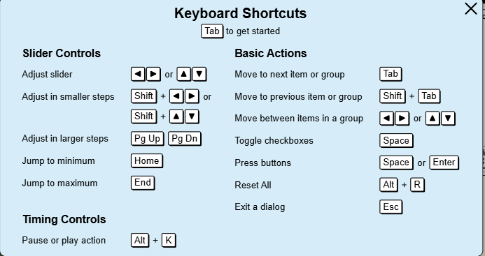

**Screens:**

All (opened from the Keyboard Shortcuts button in the global toolbar)

**Component Description:**

Provide a quick reference for keyboard interaction.

**Pedagogical significance:**

Supports accessibility and consistent interaction so all learners can explore the sim.

**Initial State:**

Not visible until Keyboard Help button is pressed.

**Design questions (default behavior):**

-

**Adjustable values:**

N/A (dialog content only).

**Pointer behavior:**

Click to open from the Keyboard Help button; close with the dialog Close button.

**Keyboard behavior:**

Dialog traps focus; Escape closes; Tab/Shift+Tab move through dialog content.

**Tab order notes:**

Not in the tab order unless the dialog is open; when open, focus is trapped within the dialog.

Modal dialog with focused Close button.

**Motion/animation:**

None (standard dialog open/close).

**Content:**

{TBD: Sim-specific shortcuts}

- Use common code to populate standard shortcuts.

**Accessibility strings (Core Description):**

```yaml
accessibleName: "Keyboard Shortcuts"

- Use common code to populate standard shortcuts.
```

**Visual ordering/overlap:**

Modal dialog above all content; background dimmed.

**Edge cases:**

?

**Sound design:**

None.
